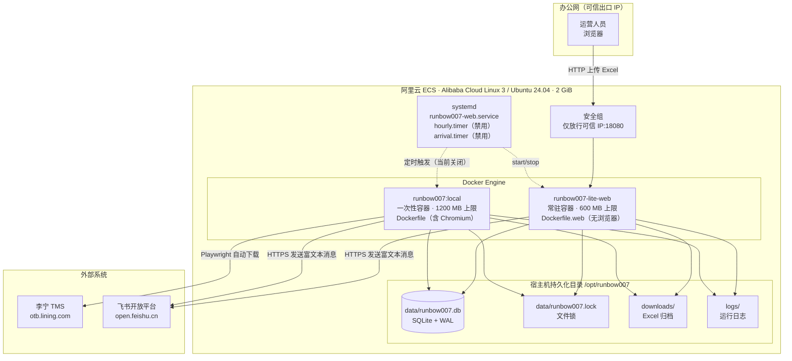
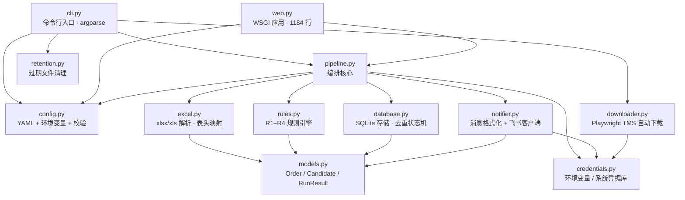
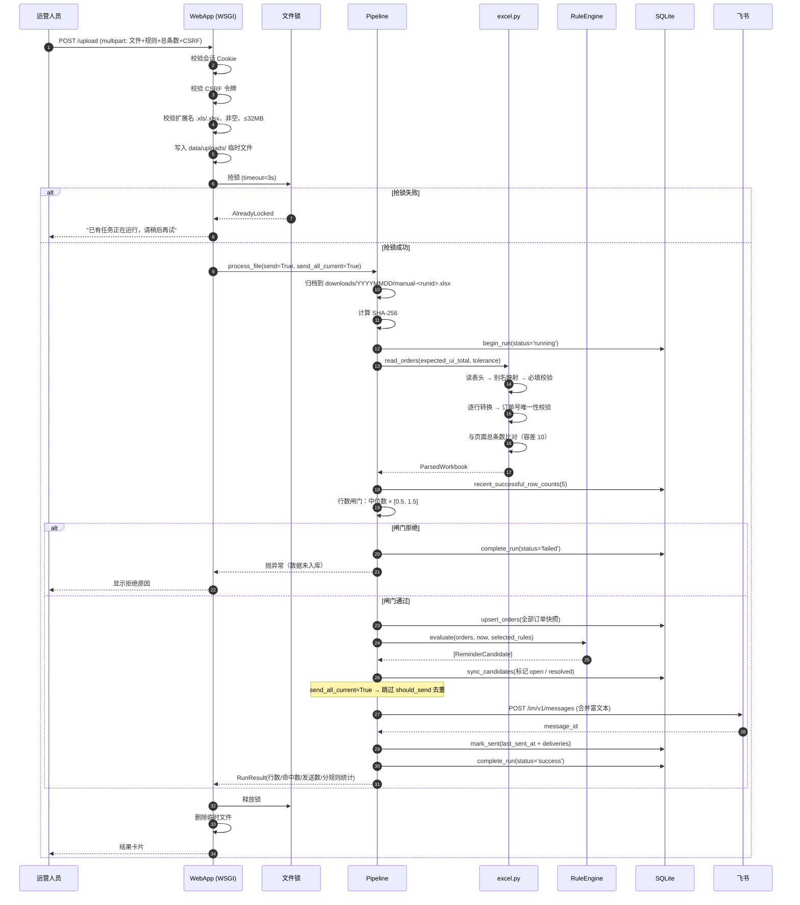
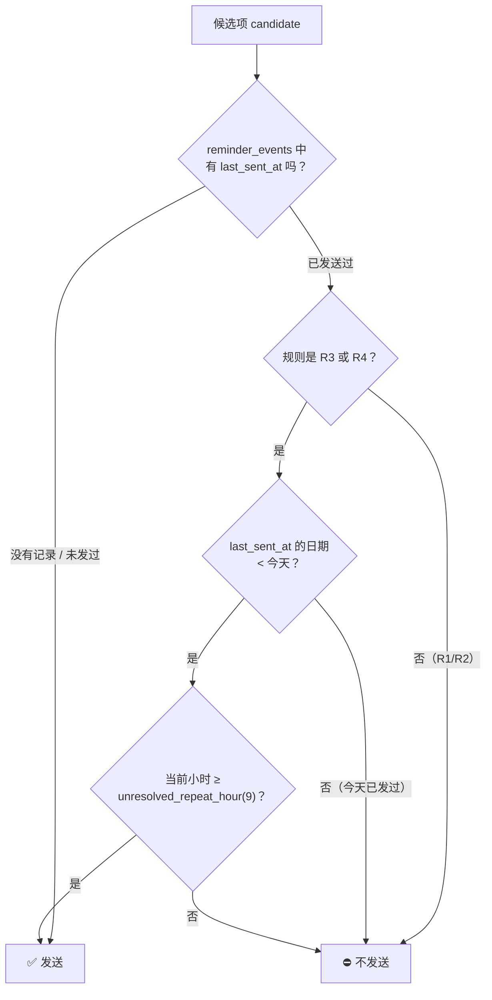
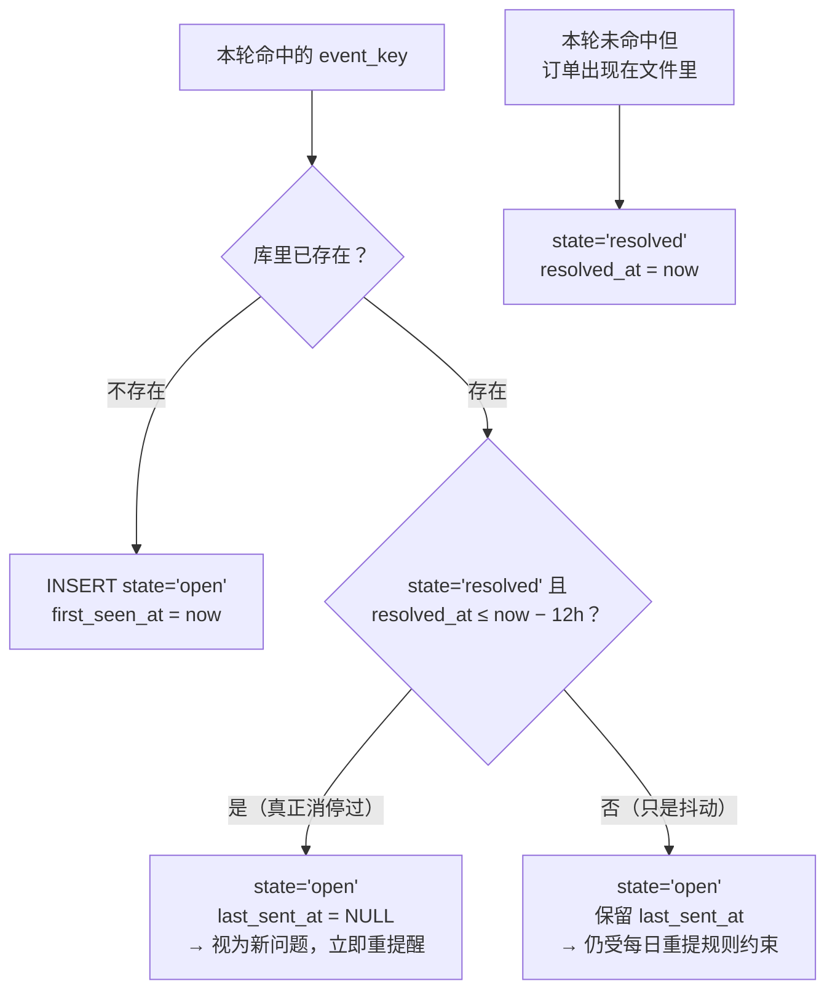
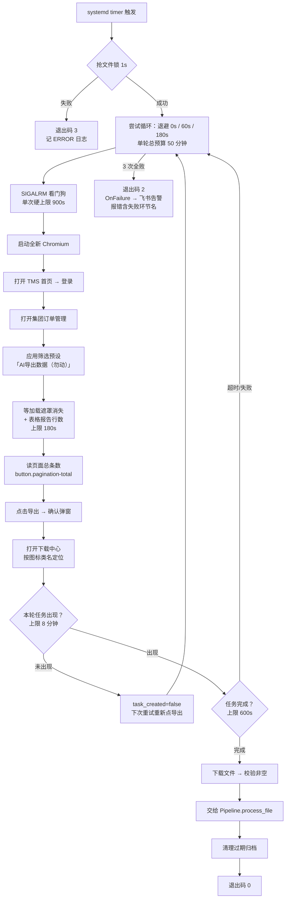
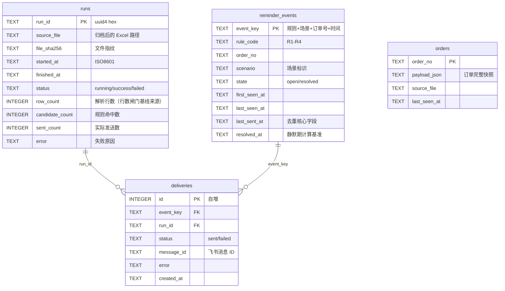
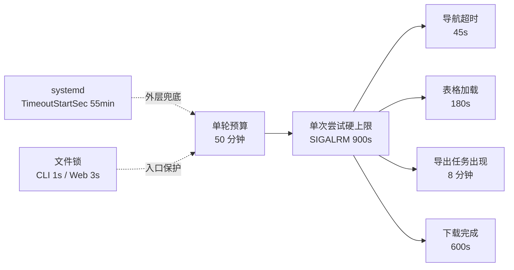

# runbow007 订单提醒工具 — 技术说明书

| 项目 | 内容 |
| --- | --- |
| 文档版本 | v1.0 |
| 对应代码版本 | `main` 分支，最新提交 `1c66cbf`（2026-08-26） |
| 编制日期 | 2026-08-26 |
| 适用读者 | 开发、运维、接手维护人员 |

---

## 1. 系统概述

runbow007 是一个单机部署的轻量批处理工具。核心链路只有一条：

```text
TMS 导出的 Excel  →  解析校验  →  R1–R4 规则匹配  →  去重决策  →  飞书群消息
                                                        ↓
                                                  SQLite 留痕
```

三个入口共用同一条链路，不存在第二套实现：

| 入口 | 触发方式 | 去重行为 | 当前状态 |
| --- | --- | --- | --- |
| 网页人工上传 | 人工登录页面上传 Excel | 不去重，全量推送 | **主流程** |
| CLI `process-file` | 命令行指定文件 | 去重（可用 `--force-send` 绕过） | 运维/验收用 |
| CLI `run` + systemd timer | 定时自动登录 TMS 下载 | 去重 | **默认关闭** |

---

## 2. 架构

### 2.1 部署架构



**关键点**：两个容器是**同一份代码的两个镜像**，共享宿主机上的数据库、归档和日志目录，并通过同一把文件锁互斥。Web 镜像不含 Playwright/Chromium，体积和内存都小一个量级。

### 2.2 模块架构



### 2.3 模块职责表

| 模块 | 行数 | 职责 | 对外接口 |
| --- | --- | --- | --- |
| `config.py` | 267 | 加载 YAML、注入环境变量、参数范围校验、目录创建 | `AppConfig.load()`、`validate()`、`ensure_directories()` |
| `models.py` | 72 | 不可变数据结构 | `Order`、`ParsedWorkbook`、`ReminderCandidate`、`RunResult` |
| `excel.py` | 276 | 双格式读取、表头别名映射、类型转换、完整性校验 | `read_orders()` |
| `rules.py` | 121 | R1–R4 纯函数式规则判定 | `RuleEngine.evaluate()` |
| `database.py` | 293 | 建表、订单快照、提醒事件状态机、发送记录、历史行数 | `SQLiteStore` |
| `notifier.py` | 273 | 富文本消息拼装、飞书鉴权与发送重试 | `MessageFormatter`、`FeishuClient` |
| `credentials.py` | 84 | 密钥获取（环境变量优先，回退系统凭据库） | `get_tms_password()`、`get_feishu_secret()` |
| `pipeline.py` | 336 | 全链路编排：归档 → 校验 → 闸门 → 规则 → 去重 → 发送 → 留痕 | `Pipeline.process_file()` |
| `web.py` | 1184 | WSGI 应用：会话、限速、CSRF、multipart 解析、页面渲染 | `WebApp`、`serve()`、`hash_password()` |
| `downloader.py` | 779 | Playwright 驱动 TMS 登录、筛选、导出、下载中心取件 | `TmsDownloader.download()` |
| `retention.py` | 36 | 按 mtime 清理过期归档 | `cleanup_old_downloads()` |
| `cli.py` | 222 | 子命令解析、文件锁、日志配置 | `main()` |

**总计约 3949 行 Python**，测试 149 个用例。

---

## 3. 技术选型

### 3.1 选型总表

| 领域 | 选型 | 版本约束 | 选择理由 |
| --- | --- | --- | --- |
| 语言 | Python | ≥ 3.11 | 团队熟悉；`zoneinfo`、`dataclass slots`、`X \| None` 语法需要 3.11+ |
| Web 框架 | **无**，标准库 `wsgiref` | — | 见 3.2 决策 D-01 |
| 数据库 | SQLite（WAL 模式） | 标准库 | 见 3.2 决策 D-02 |
| Excel 读取 | `openpyxl`（.xlsx）+ `xlrd`（.xls） | `openpyxl>=3.1,<4`、`xlrd>=2.0.1,<3` | xlrd 2.x 已放弃 xlsx 支持，必须双库；TMS 两种格式都会导出 |
| HTTP 客户端 | `requests` | `>=2.32,<3` | 只有飞书一个下游，无需异步 |
| 配置格式 | YAML（`PyYAML`） | `>=6,<7` | 需要注释说明每个阈值的来历 |
| 进程互斥 | `portalocker` | `>=3,<4` | 跨平台文件锁（Windows 本地开发 + Linux 生产） |
| 浏览器自动化 | `playwright` | `==1.62.0` 精确锁定 | 见 3.2 决策 D-06 |
| 密钥存储 | 环境变量优先 + `keyring` 回退 | `>=25,<26` | Linux 用文件注入，Windows 用凭据管理器 |
| 时区数据 | `tzdata` | `>=2024.1` | 容器内无系统时区库时的兜底 |
| 容器 | Docker + Compose | — | 服务器统一用 Docker 管理 |
| 进程守护 | systemd | — | 服务器原生，无需引入 supervisor |
| 静态检查 | `ruff` | `>=0.9,<1` | 规则集 `E,F,I,UP,B`，行宽 100 |
| 测试 | `pytest` + `pytest-cov` | `pytest>=8,<9` | 覆盖率门槛 75% |

### 3.2 关键技术决策

以下每条决策都对应一次真实的线上问题或明确的约束权衡，是本项目最值得保留的部分。

---

#### D-01：不使用任何 Web 框架，直接写 WSGI 应用

**背景**：需要一个人工上传页面。常规做法是 Flask/FastAPI + Gunicorn/Uvicorn。

**决策**：只用 Python 标准库的 `wsgiref.simple_server`，自己实现路由、会话、multipart 解析。

**理由**：
1. 服务器只有 2 GiB 内存，且要和一个可能吃 1 GB 的 Chromium 共存；
2. 页面每天只被使用几次，没有任何性能压力；
3. 引入框架意味着引入其整条依赖链，而这个镜像的价值恰恰在于"小到不需要装浏览器就能跑"；
4. Python 3.13 移除了 `cgi` 模块，`email` 库解析 multipart 需要先重组 MIME —— 与其引入依赖，不如自己切 60 行。

**代价**：路由、CSRF、会话、限速全部自己实现，需要靠测试保证正确性（`tests/test_web.py` 承担了这部分，20 个用例）。

**代码位置**：`src/runbow007/web.py`

---

#### D-02：SQLite 而非独立数据库进程

**决策**：使用 SQLite，开启 WAL 模式和外键约束。

**理由**：
1. 数据量极小：`runs` 每天几条，`orders` 约 5000 行快照，`reminder_events` 数百条；
2. 写入完全串行（有文件锁），不存在并发写冲突；
3. 独立数据库进程要占几百 MB 内存，在 2 GiB 机器上是纯浪费；
4. 备份就是拷贝一个文件。

**WAL 的作用**：Web 容器和批处理容器可能同时打开数据库（虽然写入被文件锁串行化），WAL 允许读写并发，避免"database is locked"。

**代码位置**：`src/runbow007/database.py` → `SQLiteStore.connect()`

---

#### D-03：文件锁串行化，而非任务队列

**决策**：用 `portalocker` 对 `data/runbow007.lock` 加排他锁，保证任意时刻只有一个处理任务。

**理由**：这个系统只有一个正确性要求——**永远不能有两个任务同时写库或同时发飞书**。任务队列（Celery/RQ）需要 broker，是数量级的复杂度增加，而文件锁是 3 行代码。

**两侧的超时策略不同，这是刻意设计的**：

| 侧 | 超时 | 行为 | 理由 |
| --- | --- | --- | --- |
| CLI / 定时任务 | 1 秒 | 拿不到锁立即退出，返回码 3 | 整点任务重叠说明上一轮超时了，跳过本轮比排队更合理 |
| 网页上传 | 3 秒 | 拿不到锁提示"已有任务正在运行" | 给人一个明确的即时反馈，而不是转圈 |

**关键细节**：`runbow007 web` 常驻进程**不持有锁**，只在每次上传时抢锁。否则 Web 一启动就把定时任务永久饿死。

**退出码 3 的处理**：systemd 配置了 `SuccessExitStatus=3`，所以"被跳过"不算失败。但代码里**必须**写一条 ERROR 日志——否则"整点被吃掉"在监控上完全不可见。这是 2026-08-16 复盘发现的盲区。

**代码位置**：`src/runbow007/cli.py:96`、`src/runbow007/web.py:1026`

---

#### D-04：数据合理性闸门放在写库之前

**决策**：`Pipeline._guard_row_count()` 在 `store.upsert_orders()` **之前**执行，本轮行数偏离历史中位数超过阈值就抛异常，坏数据一行都不进库。

**事故还原（2026-08-17 17:33）**：TMS 的视图状态按账号共享且粘性——默认视图就是"上一次操作的视图"。有人在浏览器里把视图切到一个 38 条的筛选，自动化用同一账号登录后原样继承，导出了 38 条而不是 4750 条。

**致命之处**：所有校验都通过了。页面总数 38、Excel 行数 38，两者完全一致，条数容差和 UI 比对查不出任何异常。于是照常算规则、照常发飞书——R1 凭空冒出 36 个候选，R3 从 274 掉到 0，真的发出了 3 条基于残缺数据的提醒。

**两个设计细节**：
1. **基线取最近 5 次成功运行的中位数，不是最近一次**。2026-08-17 18:12 又实测到继承了一个 12644 行的视图（正常 4750）。如果基线是"最近一次"，那次 12644 一旦通过就会成为基线，下一轮正常的 4750 反而被判成异常。中位数让单次异常无法污染基线。
2. **闸门是双向的**。最初只挡"太小"，18:12 那次"太大"直接放行了。现在 `max_row_ratio` 默认 1.5。
3. 行数 < 100 时跳过判断，小数据量下比例判断纯属噪声。

**代码位置**：`src/runbow007/pipeline.py` → `_guard_row_count`

---

#### D-05：网页上传全量推送，不做历史去重

**决策**：网页入口调用 `process_file(..., send_all_current=True)`，每次都推送本轮全部命中订单；自动任务和 CLI 仍走 SQLite 去重。

**理由**：人工上传是**有意识的动作**。操作人刚从 TMS 下载了文件、登录、勾选规则、点确认——如果这时候因为"昨天已经提醒过"而只推 2 条，人会怀疑工具坏了。人工触发的语义是"我要看到这一轮的完整结果"。

**保留的边界**：即使全量推送，**没有任何命中时仍然不发空消息**（`should_send and (sendable or force_send)` 的判断保证了这点），避免群里出现"本次无异常"的噪声。

**副作用**：网页发送仍然写入 `deliveries` 和 `last_sent_at`，所以它会影响后续自动任务的去重判断——这是有意的，两个入口共享同一份提醒历史。

**代码位置**：`src/runbow007/pipeline.py:76`、`src/runbow007/web.py:1027`

---

#### D-06：每轮全新浏览器，不复用持久化 profile

**决策**：`tms.persistent_profile` 默认 `false`，每轮启动全新浏览器并重新登录。

**背景**：持久化 profile 会把上一轮的标签页和 DOM 状态带到下一轮。而 TMS 是标签页式 SPA，视图状态还按账号共享，于是每轮启动时"DOM 里有几个标签页、停在哪个视图、哪些元素可见"完全不确定，所有选择器都在流沙上撞运气。

**证据**：2026-08-17 凌晨 01–07 点七轮全部成功，白天一半在挂。差别就在于白天有人在动这个 TMS 账号。

**保留退路**：`persistent_profile: true` 可退回旧行为（例如频繁登录触发 TMS 风控时）。

**代码位置**：`src/runbow007/downloader.py` → `_new_browser`

---

#### D-07：SIGALRM 看门狗作为最后一道超时

**背景**：系统里已经有三层超时，但 2026-08-17 19:05 那轮仍然挂了 70 分钟，直到 GitHub Actions 的 75 分钟工作流超时才被杀。

**根因**：三层超时全是"建议性"的。

| 层 | 依赖 | 浏览器卡死时 |
| --- | --- | --- |
| Playwright `timeout` | 驱动进程回消息 | 失效 |
| 循环 `deadline` | 当前调用能返回 | 失效 |
| 50 分钟单轮预算 | 只在两次尝试之间检查 | 失效 |

具体死因更讽刺：**是失败诊断代码本身把进程挂死的**。`_capture_failure` 截图超时正常抛出后，继续调用 `page.content()` 取 HTML —— 而 `page.content()` 不接受 timeout 参数，页面卡死时无限期挂着。

**决策**：
1. 新增 `SIGALRM` 看门狗，给单次尝试一个硬上限（`tms.attempt_timeout_seconds`，默认 900 秒）。信号由内核投递，不依赖浏览器状态，是唯一真正兜得住的一层；
2. `_capture_failure` 改成**截图成功才取 HTML**。截图失败说明浏览器已不响应，此时调 `page.content()` 必然挂死。

**原则**：诊断代码绝不能比它要诊断的问题更严重。

**已知限制**：Windows 没有 `SIGALRM`，CI 在该平台退化为无保护。生产环境是 Linux，不受影响。

**代码位置**：`src/runbow007/downloader.py` → `_attempt_watchdog`、`_capture_failure`

---

#### D-08：容器内存上限

**决策**：`app` 容器 `mem_limit: 1200m`，`web` 容器 `mem_limit: 600m`，两者 `mem_swappiness: 0`。

**事故还原（2026-08-17 晚）**：服务器只有 2 GiB 内存，compose 里没有任何限制。一个卡死的 headless Chromium（当时正在渲染继承来的 12644 行错误视图）把内存吃干净，sshd fork 不出子进程 —— SSH 报 `Connection timed out during banner exchange`，阿里云命令助手也执行不了，最后只能从控制台强制重启。

**效果**：加上限之后，撑爆的是容器而不是整台机器，至少还能 SSH 进去看日志。`mem_swappiness: 0` 避免它先把机器拖进 swap 抖动。

**判断依据**：当时暴露的问题排序里，"一次数据异常能把整台服务器打死"比数据错本身更严重。

**代码位置**：`compose.yaml`、`compose.web.yaml`

---

#### D-09：Web 专用最小镜像

**决策**：新增 `Dockerfile.web`，只 `pip install .`（不含 `[automation]` extra），不安装 Playwright、Chromium 和系统凭据库。

**对比**：

| 镜像 | 构成 | 大小量级 | 用途 |
| --- | --- | --- | --- |
| `runbow007:local` | `pip install ".[automation]"` + `playwright install --with-deps chromium` | ~1.9 GB | 自动下载批处理 |
| `runbow007-lite-web:latest` | `pip install .` | ~200 MB | 常驻上传页 |

**连带设计**：`credentials.py` 对 `keyring` 的导入做了 try/except 降级 —— Web 镜像没有 keyring，密钥全部走环境变量。

**代码位置**：`Dockerfile.web`、`src/runbow007/credentials.py:5`

---

#### D-10：buildx 构建缓存主动回收

**决策**：`deploy-alinux3.sh` 在每次构建后执行 `docker builder prune --keep-storage 5GB`。

**背景**：buildx 的构建缓存从不自动回收。镜像本身约 1.9 GB，但每次构建都会把 Playwright 的 chromium（184 MB）、headless shell（115 MB）、ffmpeg 和 apt 依赖再塞一份进缓存。2026-08-17 实测 **51 条缓存记录占了 27.3 GB**，39 GB 的盘用到 80%，照那个速度几天就写满。

**实现细节**：保留 5 GB 热缓存让下次构建仍能复用；`--keep-storage` 在新版 Docker 中改名为 `--reserved-space`，脚本逐个降级尝试；清理失败绝不能让整个部署挂掉，最后兜一个 `|| true`。

**代码位置**：`scripts/deploy-alinux3.sh`

---

#### D-11：定时任务默认关闭且部署时主动 disable

**决策**：`deploy-alinux3.sh` 在不带 `--enable-timers` 时，执行 `systemctl disable --now runbow007-hourly.timer runbow007-arrival.timer`。

**理由**：只是"不启用"不够。上一次部署开着的 timer 会原样活到下一次部署。TMS 导出经常取不到数据，默认必须是关的，开关交由 `scripts/timers-alinux3.sh on|off|status` 手动控制。

**同理**：GitHub Actions 的 `run_smoke_test` 也默认 `false`，部署不该被一次取不到数的 TMS 演练拖垮。

**代码位置**：`scripts/deploy-alinux3.sh`、`scripts/timers-alinux3.sh`

---

#### D-12：systemd 必须用 restart 而不是 enable + 直接调脚本

**事故还原（2026-08-21）**：部署脚本原来是 `systemctl enable` 之后直接调 `web-alinux3.sh start`。容器确实起来了 —— 部署日志里 `docker compose ps` 显示 Up、端口也绑上了 —— 但同一份日志里 `systemctl status` 是 `Active: inactive (dead)`。unit 从来没被启动过，只是被 enable 了。

**后果**：`systemctl stop runbow007-web.service` 会静默地什么都不做，容器照样在跑。运维想停服务时看不出任何异常。**这种沉默的失效比直接报错难查得多。**

**决策**：改成 `systemctl restart`。unit 没起来时等同于启动，已经起来时先跑 `ExecStop` 再重新拉起，顺带保证重新部署时容器一定换成新构建的镜像。

**代码位置**：`scripts/deploy-alinux3.sh`

---

#### D-13：`hmac.compare_digest` 前必须先编码

**决策**：所有密文比较走 `_same_secret()`，先 `encode("utf-8")` 再比。

**原因**：`hmac.compare_digest` 只接受纯 ASCII 的 `str`。口令里有一个中文字符就会抛 `TypeError`，登录直接变成 500 白屏。

**代码位置**：`src/runbow007/web.py` → `_same_secret`

---

#### D-14：口令支持 PBKDF2 哈希

**决策**：`web.password_hash` 优先于 `web.password`，格式 `pbkdf2_sha256$迭代次数$盐$哈希`，240000 次迭代。

**理由**：`config.yaml` 是普通文件权限，比 `/etc/runbow007/secrets.env`（0600）弱。不想在文件里放明文时，用 `runbow007 web-password` 生成哈希填进去。

**代码位置**：`src/runbow007/web.py` → `hash_password`、`verify_password`

---

#### D-15：飞书消息合并为单条

**决策**：`MessageFormatter.format_combined()` 把选中的所有规则放进**一条**飞书富文本消息，每个规则一个段落。

**理由**：四条规则四条消息在群里就是刷屏，运营会开始屏蔽这个机器人。合并后一次运行只产生一条通知。

**保留的细节**：去重模式下，如果某规则"当前有 12 个符合条件但本轮只有 3 个是新增的"，消息会明确写出"当前符合条件共 12 个订单；以下为本轮新增或到期重提醒的 3 个订单，另有 9 个此前已提醒"——避免运营误以为问题只剩 3 个。

**代码位置**：`src/runbow007/notifier.py` → `format_combined`

---

## 4. 数据流

### 4.1 网页上传主流程



### 4.2 去重决策流程（自动任务 / CLI 模式）



**复发处理（`sync_candidates`）**：



**为什么需要静默期**：命中集合每小时都在抖动，同一订单可能这轮消失、下轮又出现。如果一出现就清空 `last_sent_at`，等于抖一次就重复推送一次，每日重提醒的限制形同虚设。

### 4.3 自动下载流程（当前默认关闭）



---

## 5. 接口

### 5.1 HTTP 接口（上传页）

| 方法 | 路径 | 鉴权 | 说明 | 返回 |
| --- | --- | --- | --- | --- |
| GET | `/healthz` | 无 | 健康检查 | `200 ok`（`text/plain`） |
| GET | `/` | 无 | 跳转 | `303 → /upload` |
| GET | `/login` | 无 | 登录页；已登录则跳转 | `200 HTML` / `303 → /upload` |
| POST | `/login` | 无 | 提交账号口令 | `303 → /upload` + Set-Cookie / `200` 带错误提示 |
| POST | `/logout` | 会话 + CSRF | 退出 | `303 → /login` + 清 Cookie |
| GET | `/upload` | 会话 | 上传表单 | `200 HTML` / `303 → /login` |
| POST | `/upload` | 会话 + CSRF | 上传并处理 | `200 HTML`（结果卡片）/ `400 HTML`（错误提示） |
| 其他 | * | — | — | `404` / `405` |

**表单字段（POST /upload，`multipart/form-data`）**：

| 字段 | 类型 | 必填 | 说明 |
| --- | --- | --- | --- |
| `csrf_token` | text | 是 | 会话级 CSRF 令牌 |
| `file` | file | 是 | `.xls` / `.xlsx`，≤ `web.max_upload_mb`（默认 32 MB） |
| `rules` | text（可重复） | 是（至少一个） | `R1` / `R2` / `R3` / `R4` |
| `ui_total` | number | 否 | TMS 页面显示的总条数，> 0 |

**安全响应头（所有响应）**：

```
Cache-Control: no-store
X-Content-Type-Options: nosniff
X-Frame-Options: DENY
Referrer-Policy: no-referrer
Content-Security-Policy: default-src 'none'; style-src 'unsafe-inline';
                         form-action 'self'; base-uri 'none'; script-src 'nonce-<随机>'
```

**会话 Cookie**：`runbow007_session`，`HttpOnly`、`SameSite=Strict`、`Path=/`、`Max-Age=会话超时秒数`；`web.secure_cookie=true` 时追加 `Secure`。

### 5.2 CLI 接口

```
runbow007 --config <配置文件> <子命令> [参数]
```

| 子命令 | 参数 | 说明 |
| --- | --- | --- |
| `check-config` | — | 校验配置、创建目录、初始化数据库 |
| `process-file` | `<文件>` `--rules` `--ui-total` `--send` `--force-send` `--max-send-orders` | 处理指定 Excel |
| `run` | `--dataset current_month\|open_carryover` `--rules` `--send` `--max-send-orders` | 自动下载并处理 |
| `web` | `--host` `--port` | 启动上传页（阻塞） |
| `web-password` | — | 交互式生成 PBKDF2 口令哈希 |
| `credentials set-tms` | — | 保存 TMS 密码到系统凭据库 |
| `credentials set-feishu` | — | 保存飞书 App Secret 到系统凭据库 |
| `notify-failure` | `--unit` `--details` | 发送服务失败告警（供 systemd OnFailure 调用） |

**退出码**：

| 码 | 含义 | systemd 处理 |
| --- | --- | --- |
| 0 | 成功 | 成功 |
| 2 | 运行失败 | 失败 → 触发 `OnFailure` 飞书告警 |
| 3 | 文件锁被占用，本轮跳过 | `SuccessExitStatus=3` → 视为成功（但代码会记 ERROR 日志） |

**安全默认值**：`--send` 不加就是演练模式，不会发送任何飞书消息。`--force-send` 绕过历史去重，仅用于人工验收，**不得用于常规生产处理**。`--max-send-orders` 只能取 1–5，用于限制验收发送的影响面。

### 5.3 外部接口：飞书开放平台

| 接口 | 方法 | 用途 |
| --- | --- | --- |
| `https://open.feishu.cn/open-apis/auth/v3/tenant_access_token/internal/` | POST | 用 `app_id` + `app_secret` 换取 `tenant_access_token` |
| `https://open.feishu.cn/open-apis/im/v1/messages?receive_id_type=chat_id` | POST | 发送 `msg_type=post` 富文本消息 |

**令牌缓存**：内存缓存，提前 300 秒过期（`max(60, expire - 300)`），避免边界失效。

**重试策略**：状态码 `429/500/502/503/504` 时重试，退避 `0s → 1s → 3s`，最多 3 次。其他错误立即失败。

**失败处理**：抛 `FeishuError`，`Pipeline` 捕获后写入 `deliveries` 表（`status='failed'`）并把整个 run 标记为 `failed`。

### 5.4 外部接口：李宁 TMS

无 API，通过 Playwright 驱动页面。所有 CSS 选择器可配置（`tms.selectors`），因为 TMS 前端会变更：

| 选择器 | 默认值 | 用途 |
| --- | --- | --- |
| `username` | `input[name='username'], input[placeholder*='账号'], input[placeholder*='用户名']` | 登录用户名 |
| `password` | `input[type='password']` | 登录密码 |
| `login_button` | `.submit-btn` | 登录按钮 |
| `advanced_filter_button` | `#searchItem` | 高级筛选 |
| `preset_name` | `.el-dialog:visible .page-header-title` | 筛选预设名 |
| `query_button` | `.el-dialog:visible button.el-button--primary` | 查询按钮 |
| `total_count` | `button.pagination-total` | 页面总条数 |
| `download_button` | `button:has(.thorn6-icon-daochu), button:has(.thorn6-icon-daoru)` | 导出按钮 |
| `download_center_menu` | `ul.right_menu li.menu-item:has(.thorn6-icon-xiazai)` | 下载中心入口 |

**为什么按图标类名而不是文本定位**：文本会随 i18n 和文案调整变化，`thorn6-icon-xiazai` 这类图标类名在 TMS 里唯一且稳定。

---

## 6. 数据模型

### 6.1 表结构



**索引**：`ix_reminder_events_rule_state ON reminder_events(rule_code, state)`。

### 6.2 去重键设计

| 规则 | 去重键格式 | 含义 |
| --- | --- | --- |
| R1 | `R1\|订单号\|WMS过账时间ISO` | 过账时间变了就是新事件 |
| R2 | `R2\|订单号\|YYYY-MM-DD` | 跨天就是新事件 |
| R3 场景一 | `R3\|unsigned\|订单号` | 订单级，靠 resolved 状态和每日重提控制 |
| R3 场景二 | `R3\|operation_pending\|订单号` | 同上 |
| R4 | `R4\|订单号` | 同上 |

**关键约束**：去重键使用**内部订单号**，不是对外展示的相关单号（相关单号可能重复，`tests/test_excel.py::test_allows_duplicate_related_order_numbers` 明确覆盖了这点）。

---

## 7. 部署

### 7.1 生产环境要求

| 项目 | 要求 |
| --- | --- |
| 操作系统 | Alibaba Cloud Linux 3 或 Ubuntu 24.04 |
| 内存 | ≥ 2 GiB（仅跑 Web 时 1 GiB 可用） |
| 磁盘 | ≥ 40 GB（自动下载模式镜像和缓存较大；仅 Web 模式 10 GB 足够） |
| 运行时 | Docker CE + Buildx + Compose 插件 |
| 出网 | HTTPS 可达 `open.feishu.cn`（自动下载还需 `otb.lining.com`） |
| 入网 | 安全组仅向可信办公出口 IP 放行上传页端口 |
| 部署路径 | `/opt/runbow007` |
| 时区 | `Asia/Shanghai` |

### 7.2 两种部署形态

| 形态 | 脚本 | 镜像 | 网络 | 默认端口 | 适用 |
| --- | --- | --- | --- | --- | --- |
| **仅上传页（推荐）** | `scripts/rebuild-web-alinux3.sh` | `Dockerfile.web` | `network_mode: host` | 18080 | 只需要人工上传 |
| 完整部署 | `scripts/deploy-alinux3.sh` | `Dockerfile` + `Dockerfile.web` | bridge + 端口映射 | 8080 | 需要保留自动下载能力 |

**为什么仅 Web 形态用 host 网络**：该服务器的 Docker bridge DNS 不可用，构建和运行时都必须复用宿主机网络。

### 7.3 密钥管理

| 环境 | 存储位置 | 权限 |
| --- | --- | --- |
| Linux 生产 | `/etc/runbow007/secrets.env` | `0600`，目录 `0750` |
| Windows 本地 | Windows 凭据管理器（`keyring`） | 系统托管 |
| GitHub Actions | Repository secrets | GitHub 托管 |

**注入路径**：`secrets.env` → Compose `env_file` → 容器环境变量 → `config.py` 的 `_environment_value()` 覆盖 YAML 中的值。密钥**不进镜像、不进仓库、不进日志**。

**环境变量清单**：

| 变量 | 用途 | 仅 Web 模式是否必需 |
| --- | --- | --- |
| `RUNBOW007_FEISHU_APP_ID` | 飞书自建应用 ID | 是 |
| `RUNBOW007_FEISHU_APP_SECRET` | 飞书应用密钥 | 是 |
| `RUNBOW007_FEISHU_CHAT_ID` | 目标群 ID | 是 |
| `RUNBOW007_WEB_USERNAME` | 上传页账号 | 是 |
| `RUNBOW007_WEB_PASSWORD` | 上传页口令 | 是 |
| `RUNBOW007_WEB_PASSWORD_HASH` | 上传页口令哈希（优先） | 否 |
| `RUNBOW007_WEB_HOST` / `RUNBOW007_WEB_PORT` | 监听地址与端口 | 否 |
| `RUNBOW007_TMS_USERNAME` / `RUNBOW007_TMS_PASSWORD` | TMS 账号密码 | 否（自动下载才需要） |
| `RUNBOW007_ENABLE_SENDING` | 定时任务是否真实发送 | 否（仅影响定时任务） |

**注意**：`RUNBOW007_ENABLE_SENDING` **不影响网页上传**。网页上传固定直接发送。

### 7.4 持久化目录

| 路径 | 内容 | 属主 | 备份优先级 |
| --- | --- | --- | --- |
| `/opt/runbow007/data/` | SQLite 数据库、文件锁、上传临时目录 | `10001:10001` | **最高** |
| `/opt/runbow007/downloads/` | 按日期分目录的 Excel 归档 | `10001:10001` | 中 |
| `/opt/runbow007/logs/` | 按天切分的运行日志 | `10001:10001` | 中 |
| `/opt/runbow007/browser-profile/` | 可选的 Playwright 持久化配置 | `10001:10001` | 无 |
| `/opt/runbow007/config.yaml` | 非敏感配置（只读挂载） | root | 高 |
| `/etc/runbow007/secrets.env` | 密钥（`0600`） | root | **最高，单独保管** |

容器以非 root 用户 `runbow007`（UID 10001）运行，所有容器均设置 `no-new-privileges:true`。

### 7.5 systemd 单元

| 单元 | 类型 | 默认状态 | 说明 |
| --- | --- | --- | --- |
| `runbow007-web.service` | `oneshot` + `RemainAfterExit` | **enabled + started** | 上传页生命周期 |
| `runbow007-hourly.timer` | timer | **disabled** | 每小时第 5 分钟，R1/R3/R4 |
| `runbow007-arrival.timer` | timer | **disabled** | 每天 13:30，R2 |
| `runbow007-failure@.service` | `oneshot` | 模板 | `OnFailure` 触发，发飞书告警 |

`TimeoutStartSec=55min`：卡死的一轮必须在下个整点前被收掉。

### 7.6 CI/CD

| 工作流 | 触发 | 内容 |
| --- | --- | --- |
| `ci.yml` | `push` + `pull_request` | Ubuntu + Windows 双平台：`ruff check` + `pytest`（覆盖率门槛 75%） |
| `deploy.yml` | **仅手动** `workflow_dispatch` | 打包 → SSH 传输 → 远端部署脚本 |

`deploy.yml` 的三个安全开关默认全部 `false`：`run_smoke_test`、`enable_timers`、`enable_sending`。

**部署链路安全措施**：`StrictHostKeyChecking=yes` + 固定 `known_hosts`、SHA 白名单校验、tar 包路径穿越检查、密钥文件 `0600` 且 `if: always()` 清理。

---

## 8. 性能与容量

### 8.1 实测数据

| 指标 | 实测值 | 来源 |
| --- | --- | --- |
| 典型数据量 | 约 4750 个唯一订单 | 生产运行记录 |
| TMS 导出耗时 | 4672 单约 2–3 分钟 | 2026-08-16 实测，据此把 `download_timeout_seconds` 从 1200 降到 600 |
| 单次上传端到端 | 秒级（解析 + 规则 + 发送） | 无浏览器环节 |
| Web 容器内存 | 上限 600 MB | `compose.web.yaml` |
| 批处理容器内存 | 上限 1200 MB | `compose.yaml` |
| Web 镜像大小 | 约 200 MB | 不含 Chromium |
| 完整镜像大小 | 约 1.9 GB | 含 Playwright + Chromium |
| 使用频次 | 每天个位数次 | 人工上传 |

### 8.2 超时配置全景



**约束关系**：`export_task_appear_minutes`（8）× 3 次尝试 + 退避时间必须落在 50 分钟单轮预算内，而 50 分钟又必须小于 55 分钟的 systemd 超时和 60 分钟的整点间隔。改动任一值都要重新核对这条链。

### 8.3 容量上限与扩展点

| 维度 | 当前上限 | 触及后怎么办 |
| --- | --- | --- |
| 上传文件大小 | 32 MB（`web.max_upload_mb`，可调 1–200） | 调大配置 |
| 单文件订单数 | 无硬限制，内存中全量持有 | 4750 单占用极小；十万级需改为流式处理 |
| 并发上传 | 1（文件锁串行） | 这是正确性要求，不应放开 |
| 会话数 | 无限制（进程内字典，过期自动清理） | 单用户场景无压力 |
| 登录限速 | 5 次失败 / 15 分钟封禁 | 常量，需改代码 |
| 数据库 | SQLite 单文件 | 数据量增长百倍才需要考虑迁移 |
| 日志保留 | 30 天（`runtime.retain_days`，可调 1–3650） | 调配置 |
| 归档保留 | 30 天，**仅在 CLI 运行时清理** | 只跑 Web 时需要额外 cron 清理 |

**已知运维缺口**：`retention.cleanup_old_downloads()` 只在 CLI 任务结束时调用。当前定时任务默认关闭，如果长期只用网页上传，`downloads/` 会无限增长。上传的临时文件会在每次请求结束后立即删除，不受此影响。

### 8.4 可靠性设计汇总

| 风险 | 防护措施 |
| --- | --- |
| 并发写库 / 重复发送 | 文件锁串行化 |
| 错误数据集触发错误提醒 | 行数闸门（写库前拦截） |
| 页面总数与文件不符 | UI 总条数比对 + 10 条容差 |
| 订单号重复 | 解析阶段直接拒绝 |
| 飞书临时故障 | 3 次退避重试 |
| 飞书永久失败 | 记入 `deliveries` + run 标记 failed |
| 浏览器卡死 | SIGALRM 看门狗 |
| 浏览器吃光内存 | 容器 `mem_limit` |
| 磁盘被构建缓存写满 | 每次部署后 `builder prune` |
| 整点任务重叠 | 文件锁 + 退出码 3 + ERROR 日志 |
| 自动任务失败无人知 | `OnFailure` → 飞书告警 |
| 口令在线爆破 | 5 次失败限速 15 分钟 |
| 会话劫持 | HttpOnly + SameSite=Strict + CSRF |
| 服务静默失效 | `systemctl restart` + 健康检查 |
| 提醒刷屏 | 合并单条消息 + 去重 + 每日重提上限 |

---

## 9. 开发与测试

### 9.1 本地开发

```bash
python -m pip install -e ".[dev]"
python -m playwright install chromium   # 仅需调试自动下载时
python -m ruff check .
python -m pytest
```

要求 Python ≥ 3.11。

### 9.2 测试结构

| 测试文件 | 覆盖内容 |
| --- | --- |
| `test_config.py` | 配置加载、环境变量覆盖、参数范围校验 |
| `test_excel.py` | 双格式解析、表头别名、必填校验、唯一性、总条数容差 |
| `test_rules.py` | R1–R4 各自的触发与不触发边界、在途状态别名、去重键 |
| `test_database.py` | 事件状态机、去重判断、静默期、历史行数 |
| `test_notifier.py` | 消息格式、@ 逻辑、合并消息、飞书重试与错误 |
| `test_pipeline_integration.py` | 端到端：归档、去重、全量发送、行数闸门、失败留痕 |
| `test_web.py` | 登录、限速、CSRF、会话、上传校验、锁冲突、安全头、multipart |
| `test_downloader.py` | 可见性探测、导出按钮选择、下载中心匹配、看门狗 |
| `test_cli_integration.py` | 子命令、退出码、演练模式 |
| `test_credentials.py` | 环境变量优先、keyring 降级 |
| `test_retention.py` | 过期清理、无效保留期 |
| `test_deployment_files.py` | systemd 单元、compose、脚本的一致性 |

共 **149 个用例**，行覆盖率门槛 75%（`--cov-fail-under=75`）。

### 9.3 代码规范

- `ruff` 规则集：`E`（pycodestyle）、`F`（pyflakes）、`I`（isort）、`UP`（pyupgrade）、`B`（bugbear）
- 行宽 100，目标版本 `py311`
- 全部模块使用 `from __future__ import annotations`
- 数据类统一 `frozen=True, slots=True`（除需要可变的配置类）
- **注释规范**：所有非显而易见的设计决策在代码里写明"为什么"，并附上实测日期与数据。这是本项目刻意维持的做法 —— 阈值、超时、闸门比例这些数字如果没有出处，下一个人只能靠猜。

---

## 附录：配置项全表

### `runtime`

| 键 | 默认值 | 校验 | 说明 |
| --- | --- | --- | --- |
| `timezone` | `Asia/Shanghai` | — | 所有时间判定基准 |
| `data_dir` | `data` | — | 数据库与临时目录 |
| `downloads_dir` | `downloads` | — | Excel 归档 |
| `logs_dir` | `logs` | — | 日志 |
| `browser_profile_dir` | `browser-profile` | — | 可选 Playwright profile |
| `database_path` | `data/runbow007.db` | — | SQLite 文件 |
| `lock_path` | `data/runbow007.lock` | — | 文件锁 |
| `retain_days` | `30` | 1–3650 | 日志与归档保留天数 |

### `tms`

| 键 | 默认值 | 校验 | 说明 |
| --- | --- | --- | --- |
| `url` | `https://otb.lining.com/#/` | 必须 HTTPS | TMS 地址 |
| `username` | `""` | — | 可被 `RUNBOW007_TMS_USERNAME` 覆盖 |
| `headless` | `true` | — | 首次校准页面时可临时设 `false` |
| `persistent_profile` | `false` | — | 见决策 D-06 |
| `navigation_timeout_seconds` | `45` | — | 页面导航超时 |
| `download_timeout_seconds` | `600` | 60–1800 | 下载完成上限 |
| `grid_load_timeout_seconds` | `180` | 10–900 | 表格出数据上限 |
| `attempt_timeout_seconds` | `900` | 60–3600，0 关闭 | SIGALRM 硬上限 |
| `export_task_appear_minutes` | `8` | 1–30 | 下载中心任务出现上限 |
| `total_tolerance` | `10` | 0–1000 | 页面总数与 Excel 行数容差 |
| `current_month_preset` | `AI导出数据（勿动）` | — | 筛选预设名 |
| `open_carryover_preset` | `""` | — | 历史未完结预设名 |

### `feishu`

| 键 | 默认值 | 说明 |
| --- | --- | --- |
| `app_id` | `cli_aaf95da631385d01` | 可被环境变量覆盖 |
| `chat_id` | `oc_f79000009c4f09cbdf78b55fd35ae04a` | 目标群 |
| `mention_user_id` | `""` | 留空则不 @ |
| `mention_name` | `许昊` | 展示名 |
| `request_timeout_seconds` | `20` | HTTP 超时 |

### `web`

| 键 | 默认值 | 校验 | 说明 |
| --- | --- | --- | --- |
| `host` | `0.0.0.0` | — | 容器内必须监听全网卡 |
| `port` | `8080` | 1–65535 | 监听端口 |
| `username` | `admin` | 非空 | 登录账号 |
| `password` | `admin123456` | 与 hash 至少填一个 | **默认口令必须改** |
| `password_hash` | `""` | — | 优先于 `password` |
| `session_timeout_minutes` | `480` | 5–10080 | 会话有效期 |
| `max_upload_mb` | `32` | 1–200 | 上传大小上限 |
| `default_rules` | `[R1,R2,R3,R4]` | 仅 R1–R4 | 页面默认勾选 |
| `secure_cookie` | `false` | — | 整站 HTTPS 时才设 `true` |

### `rules`

| 键 | 默认值 | 校验 | 说明 |
| --- | --- | --- | --- |
| `enabled` | `[R1,R2,R3,R4]` | 仅 R1–R4 | 全局启用的规则 |
| `wms_lead_minutes` | `90` | 1–1440 | R1 阈值 |
| `unresolved_repeat_hour` | `9` | 0–23 | R3/R4 每日重提起始小时 |
| `reopen_grace_hours` | `12` | 0–720 | 复发静默期 |
| `min_row_ratio` | `0.5` | 0 ≤ x < 1，0 关闭 | 行数下限比例 |
| `max_row_ratio` | `1.5` | > 1，0 关闭 | 行数上限比例 |
