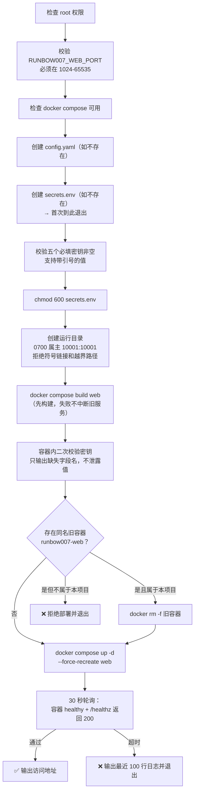

# runbow007 订单提醒工具 — 生产部署手册

| 项目 | 内容 |
| --- | --- |
| 文档版本 | v1.0 |
| 对应代码版本 | `main` 分支，最新提交 `1c66cbf`（2026-08-26） |
| 编制日期 | 2026-08-26 |
| 适用读者 | 运维工程师、系统管理员 |
| 部署性质 | **生产环境**，非 demo。含真实密钥管理、权限收敛、资源限制、开机自启、健康检查、备份与回滚 |

---

## 0. 本项目的"生产级"体现在哪里

这不是一个"能跑起来"的演示，以下每一项都是生产环境必须而 demo 不会有的：

| 生产要求 | 本项目的实现 | 位置 |
| --- | --- | --- |
| 密钥不落代码库 | `/etc/runbow007/secrets.env`（`0600`）注入环境变量，`.gitignore` + `.dockerignore` 双重排除 | `deploy/secrets.env.example` |
| 密钥不进镜像 | Compose `env_file` 运行时注入，镜像里没有任何密钥 | `compose.web.yaml` |
| 口令不存明文 | 支持 PBKDF2-SHA256（240000 次迭代）哈希 | `runbow007 web-password` |
| 容器非 root 运行 | UID 10001 专用用户，`no-new-privileges:true` | `Dockerfile.web` |
| 资源硬限制 | Web 600 MB / 批处理 1200 MB，`mem_swappiness: 0` | `compose*.yaml` |
| 开机自启 + 自愈 | systemd unit + `restart: unless-stopped` | `deploy/systemd/` |
| 健康检查 | 容器 healthcheck + `/healthz` 端点 + 部署脚本 30 秒轮询 | `compose.web.yaml` |
| 配置校验前置 | 启动时校验全部参数范围，配置错误立即失败而非运行时崩 | `config.py::validate` |
| 数据完整性防护 | 行数合理性闸门，坏数据写库前拦截 | `pipeline.py::_guard_row_count` |
| 并发安全 | 跨进程文件锁，Web 与定时任务互斥 | `portalocker` |
| 全链路留痕 | 每次运行记录 SHA-256、行数、命中数、发送数、失败原因 | `runs` / `deliveries` 表 |
| 日志轮转 | 按天切分，保留 30 天 | `TimedRotatingFileHandler` |
| 磁盘防护 | 每次部署回收 buildx 缓存，归档按保留期清理 | `deploy-alinux3.sh` |
| 失败告警 | systemd `OnFailure` → 飞书通知 | `runbow007-failure@.service` |
| 部署链路安全 | 固定 `known_hosts`、SHA 白名单、tar 路径穿越检查、密钥必清理 | `.github/workflows/deploy.yml` |
| 幂等部署 | 反复执行同一条命令结果一致，不破坏已有数据 | `rebuild-web-alinux3.sh` |
| 质量门禁 | 双平台 CI + 149 用例 + 75% 覆盖率强制 | `.github/workflows/ci.yml` |

---

## 1. 部署形态选择

| 形态 | 适用场景 | 镜像 | 内存需求 | 磁盘需求 | 推荐度 |
| --- | --- | --- | --- | --- | --- |
| **A. 仅上传页（轻量）** | 只做人工上传 → 解析 → 推送飞书 | `Dockerfile.web`（约 200 MB） | ≥ 1 GiB | ≥ 10 GB | ⭐ **推荐** |
| **B. 完整部署** | 需要保留 TMS 自动下载能力 | 两个镜像（含 Chromium，约 1.9 GB） | ≥ 2 GiB | ≥ 40 GB | 按需 |

形态 A 不安装 Playwright、Chromium 和系统凭据库，也不会启动任何自动下载定时任务。

> **当前生产环境使用形态 A。** TMS 后台导出不稳定，自动下载不作为承诺可用的能力。

---

## 2. 环境准备

### 2.1 服务器要求

| 项目 | 形态 A | 形态 B |
| --- | --- | --- |
| 操作系统 | Alibaba Cloud Linux 3 / Ubuntu 24.04 | 同左 |
| CPU | 1 核 | 2 核 |
| 内存 | 1 GiB | 2 GiB |
| 磁盘 | 10 GB | 40 GB |
| 部署路径 | `/opt/runbow007` | `/opt/runbow007`（**强制**，脚本会校验） |
| 时区 | `Asia/Shanghai` | 同左 |

### 2.2 网络要求

**出网（必须）**：

| 目标 | 端口 | 用途 | 形态 A 是否必需 |
| --- | --- | --- | --- |
| `open.feishu.cn` | 443 | 发送提醒消息 | 是 |
| `otb.lining.com` | 443 | TMS 自动下载 | 否 |
| Docker 镜像源 | 443 | 构建镜像 | 是（首次） |
| PyPI | 443 | 安装依赖 | 是（首次） |

**入网（严格收敛）**：

```
安全组入方向规则：
  协议/端口：TCP/18080
  授权对象：<办公网出口 IP>/32     ← 必须是具体 IP，禁止 0.0.0.0/0
  优先级：1
  描述：runbow007 上传页
```

> ⚠️ **上传页本身不提供 HTTPS**。直接开放端口时**必须**限制来源 IP。如果通过 HTTPS 反向代理访问，再把 `config.yaml` 里的 `web.secure_cookie` 设为 `true`。

### 2.3 安装 Docker

**Alibaba Cloud Linux 3**：

```bash
sudo dnf -y install wget
sudo wget -qO /etc/yum.repos.d/docker-ce.repo \
  http://mirrors.cloud.aliyuncs.com/docker-ce/linux/centos/docker-ce.repo
sudo sed -i 's|https://mirrors.aliyun.com|http://mirrors.cloud.aliyuncs.com|g' \
  /etc/yum.repos.d/docker-ce.repo
sudo dnf -y install dnf-plugin-releasever-adapter --repo alinux3-plus
sudo dnf -y install docker-ce docker-ce-cli containerd.io \
  docker-buildx-plugin docker-compose-plugin
sudo systemctl enable --now docker
```

**Ubuntu 24.04**：

```bash
sudo apt-get update
sudo DEBIAN_FRONTEND=noninteractive apt-get install -y ca-certificates curl
sudo install -m 0755 -d /etc/apt/keyrings
sudo curl -fsSL https://download.docker.com/linux/ubuntu/gpg \
  -o /etc/apt/keyrings/docker.asc
sudo chmod a+r /etc/apt/keyrings/docker.asc
. /etc/os-release
printf '%s\n' \
  'Types: deb' \
  'URIs: https://download.docker.com/linux/ubuntu' \
  "Suites: ${UBUNTU_CODENAME:-$VERSION_CODENAME}" \
  'Components: stable' \
  "Architectures: $(dpkg --print-architecture)" \
  'Signed-By: /etc/apt/keyrings/docker.asc' \
  | sudo tee /etc/apt/sources.list.d/docker.sources
sudo apt-get update
sudo DEBIAN_FRONTEND=noninteractive apt-get install -y docker-ce docker-ce-cli \
  containerd.io docker-buildx-plugin docker-compose-plugin
sudo systemctl enable --now docker
```

**验证**：

```bash
docker --version
docker compose version     # 必须可用，脚本会检查
```

### 2.4 准备飞书自建应用

1. 在飞书开放平台创建**自建应用**；
2. 记录 **App ID** 和 **App Secret**；
3. 开通权限：`im:message`（发送消息）、`im:message:send_as_bot`；
4. 发布应用并等待审批通过；
5. 把机器人**拉进目标群**；
6. 获取群的 **chat_id**（形如 `oc_xxxxxxxx`）；
7. 如需 @ 特定人，获取该用户的 `open_id`。

---

## 3. 形态 A：仅上传页部署（推荐）

### 3.1 首次安装

```bash
# 1. 拉取代码到强制路径
sudo git clone https://github.com/haoxumgg/runbow007-lite.git /opt/runbow007
cd /opt/runbow007

# 2. 首次执行（会创建配置模板后主动退出）
sudo ./scripts/rebuild-web-alinux3.sh
```

第一次运行会创建 `/opt/runbow007/config.yaml` 和 `/etc/runbow007/secrets.env`，然后提示填写配置并退出（返回码 2）。这是预期行为。

### 3.2 填写密钥

```bash
sudo vi /etc/runbow007/secrets.env
```

形态 A 只需要以下五项：

```dotenv
RUNBOW007_FEISHU_APP_ID='cli_xxxxxxxxxxxx'
RUNBOW007_FEISHU_APP_SECRET='填写飞书 App Secret'
RUNBOW007_FEISHU_CHAT_ID='oc_xxxxxxxxxxxxxxxx'
RUNBOW007_WEB_USERNAME='填写上传页账号'
RUNBOW007_WEB_PASSWORD='填写强口令'
```

**格式要求**：

| 要求 | 原因 |
| --- | --- |
| 值中包含 `$` 时**必须用单引号包住整个值** | 避免 Docker Compose 变量插值 |
| 值必须是**单行** | 部署链路会拒绝多行值 |
| 不要用默认账号 `admin` / `admin123456` | 公网可达时等于无防护 |
| 口令建议 16 位以上，含大小写字母、数字、符号 | 单账号共享，一旦泄露无法追溯到人 |

```bash
sudo chmod 600 /etc/runbow007/secrets.env
sudo chmod 750 /etc/runbow007
```

### 3.3 调整非敏感配置（可选）

```bash
sudo vi /opt/runbow007/config.yaml
```

生产环境需要关注的项：

```yaml
web:
  session_timeout_minutes: 480   # 会话有效期，可缩短到 120 提高安全性
  max_upload_mb: 32              # 上传上限
  default_rules: [R1, R2, R3, R4]
  secure_cookie: false           # 有 HTTPS 反代时改为 true

feishu:
  mention_user_id: ""            # 填 open_id 后消息会真正 @ 到人
  mention_name: 许昊

rules:
  wms_lead_minutes: 90           # R1 阈值
  unresolved_repeat_hour: 9      # R3/R4 每日重提起始小时
  reopen_grace_hours: 12         # 复发静默期
  min_row_ratio: 0.5             # 行数下限比例，0 关闭
  max_row_ratio: 1.5             # 行数上限比例，0 关闭

runtime:
  retain_days: 30                # 日志与归档保留天数
```

### 3.4 完成部署

```bash
cd /opt/runbow007
sudo ./scripts/rebuild-web-alinux3.sh
```

脚本会依次执行：



**成功输出**：

```
runbow007 Web 已启动
本机健康检查: http://127.0.0.1:18080/healthz
公网访问地址: http://<服务器公网IP>:18080/
```

### 3.5 自定义端口

```bash
sudo RUNBOW007_WEB_PORT=28080 ./scripts/rebuild-web-alinux3.sh
```

端口必须在 1024–65535 之间。**改端口后记得同步更新安全组规则。**

### 3.6 形态 A 的网络说明

`compose.web.yaml` 使用 `network_mode: host` 且构建时也用 `network: host`。

**原因**：该服务器的 Docker bridge DNS 不可用。

**影响**：容器直接监听宿主机端口，没有 Docker 的端口映射层。防护完全依赖服务器安全组。

---

## 4. 形态 B：完整部署

### 4.1 安装

```bash
sudo git clone https://github.com/haoxumgg/runbow007-lite.git /opt/runbow007
cd /opt/runbow007
sudo ./scripts/deploy-alinux3.sh
```

脚本会：

1. 创建 `/etc/runbow007/{secrets.env,runtime.env}` 和 `config.yaml` 模板；
2. 创建运行目录并设置属主为 `10001:10001`；
3. 构建 `runbow007:local` 镜像（含 Playwright + Chromium）；
4. **回收 buildx 构建缓存**，保留 5 GB 热缓存；
5. 安装全部 systemd unit；
6. `systemctl enable` + **`restart`** `runbow007-web.service`；
7. **主动 `disable --now` 两个自动下载 timer**。

第 4 步和第 7 步是生产环境的关键，见 4.4 和 4.5。

### 4.2 填写密钥

```bash
sudo vi /etc/runbow007/secrets.env
```

```dotenv
RUNBOW007_TMS_USERNAME='填写 TMS 账号'
RUNBOW007_TMS_PASSWORD='填写 TMS 密码'
RUNBOW007_FEISHU_APP_ID='填写飞书 App ID'
RUNBOW007_FEISHU_APP_SECRET='填写飞书 App Secret'
RUNBOW007_FEISHU_CHAT_ID='填写飞书群 ID'
RUNBOW007_WEB_USERNAME='填写上传页账号'
RUNBOW007_WEB_PASSWORD='填写上传页口令'
```

```bash
sudo chmod 600 /etc/runbow007/secrets.env
sudo systemctl restart runbow007-web.service
```

### 4.3 运行时开关

```bash
sudo vi /etc/runbow007/runtime.env
```

```dotenv
RUNBOW007_ROOT=/opt/runbow007
RUNBOW007_SECRETS_FILE=/etc/runbow007/secrets.env
# 首轮保持 false；验收通过后改为 true 并重启定时器
RUNBOW007_ENABLE_SENDING=false
RUNBOW007_WEB_PORT=8080
```

> **重要**：`RUNBOW007_ENABLE_SENDING` **只影响定时任务**。网页上传固定直接发送，不受此开关控制。

### 4.4 为什么部署脚本要回收 buildx 缓存

buildx 的构建缓存**从不自动回收**。镜像本身约 1.9 GB，但每次构建都会把 Playwright 的 chromium（184 MB）、headless shell（115 MB）、ffmpeg 和 apt 依赖再塞一份进缓存。

**实测数据（2026-08-17）**：51 条缓存记录占了 **27.3 GB**，39 GB 的盘用到 80%，照那个速度几天就会写满。

脚本的处理：

```bash
docker builder prune --force --keep-storage 5GB \
  || docker builder prune --force --reserved-space 5GB \
  || docker builder prune --force \
  || true
```

保留 5 GB 热缓存让下次构建仍能复用；`--keep-storage` 在新版 Docker 中已改名为 `--reserved-space`，逐个降级尝试；**清理失败绝不能让整个部署挂掉**，所以最后兜一个 `true`。

### 4.5 为什么部署脚本要主动 disable 定时器

只是"不启用"不够 —— 上一次部署开着的 timer 会原样活到下一次部署。TMS 导出经常取不到数据，默认必须是关的。

```bash
# 查看状态
sudo /opt/runbow007/scripts/timers-alinux3.sh status

# 需要时手动开启
sudo /opt/runbow007/scripts/timers-alinux3.sh on

# 关闭（只停止并禁用，不删除 unit）
sudo /opt/runbow007/scripts/timers-alinux3.sh off
```

带 `--enable-timers` 参数部署可以在部署时直接启用：

```bash
sudo ./scripts/deploy-alinux3.sh --enable-timers
```

### 4.6 定时任务清单

| Timer | 调度 | 规则 | 默认状态 |
| --- | --- | --- | --- |
| `runbow007-hourly.timer` | 每小时第 5 分钟，Asia/Shanghai | R1/R3/R4 | disabled |
| `runbow007-arrival.timer` | 每天 13:30，Asia/Shanghai | R2 | disabled |

两个 service 都配置了：

- `TimeoutStartSec=55min` —— 卡死的一轮必须在下个整点前被收掉；
- `SuccessExitStatus=3` —— 被文件锁跳过不算失败（但代码会记 ERROR 日志）；
- `OnFailure=runbow007-failure@%n.service` —— 失败自动发飞书告警。

---

## 5. 生产配置基线

### 5.1 必须修改的默认值

| 配置项 | 默认值 | 生产要求 | 理由 |
| --- | --- | --- | --- |
| `web.username` | `admin` | **必改** | 默认账号是公开信息 |
| `web.password` | `admin123456` | **必改**（≥16 位强口令） | 同上；启动时会输出警告日志 |
| `feishu.chat_id` | 示例群 ID | 改为真实群 | 否则发到错误的群 |
| `feishu.app_id` | 示例 App ID | 改为真实应用 | — |
| 安全组入方向 | — | **必须限制到具体 IP** | 页面无 HTTPS，无 IP 限制等于裸奔 |

### 5.2 推荐加固项

| 项目 | 做法 | 收益 |
| --- | --- | --- |
| 口令改用哈希存储 | 见 5.3 | `config.yaml` 中不出现明文 |
| 缩短会话有效期 | `session_timeout_minutes: 120` | 减少会话被盗用窗口 |
| 前置 HTTPS 反向代理 | Nginx/ALB 终结 TLS + `secure_cookie: true` | 传输加密 |
| 独立数据盘 | `data/`、`downloads/`、`logs/` 挂载到独立云盘 | 系统盘写满不影响数据 |
| 云监控告警 | 磁盘 > 80%、内存 > 90% 时告警 | 提前发现 |
| 定期备份 | 见第 8 节 | 可恢复 |

### 5.3 生成口令哈希

```bash
cd /opt/runbow007
sudo env RUNBOW007_SECRETS_FILE=/etc/runbow007/secrets.env \
  docker compose run --rm app --config /app/config.yaml web-password
```

交互式输入两次口令，输出形如：

```
pbkdf2_sha256$240000$<盐 hex>$<哈希 hex>
```

把这一行填到 `config.yaml` 的 `web.password_hash`，并**清空 `web.password`**。哈希优先级高于明文口令。

也可以通过环境变量注入：`RUNBOW007_WEB_PASSWORD_HASH`。

### 5.4 文件权限基线

| 路径 | 权限 | 属主 |
| --- | --- | --- |
| `/etc/runbow007/` | `0750` | `root:root` |
| `/etc/runbow007/secrets.env` | `0600` | `root:root` |
| `/etc/runbow007/runtime.env` | `0640` | `root:root` |
| `/opt/runbow007/config.yaml` | `0644` | `root:root` |
| `/opt/runbow007/data/` | `0700` | `10001:10001` |
| `/opt/runbow007/downloads/` | `0700` | `10001:10001` |
| `/opt/runbow007/logs/` | `0700` | `10001:10001` |

**验证**：

```bash
sudo ls -ld /etc/runbow007 /etc/runbow007/secrets.env
sudo ls -ld /opt/runbow007/{data,downloads,logs}
```

`rebuild-web-alinux3.sh` 每次执行都会重新设置运行目录的权限，并**拒绝处理符号链接或项目目录之外的路径**。

---

## 6. 部署后验收

按顺序执行，全部通过才算部署完成。

### 6.1 服务层

```bash
# 1. 容器运行中
sudo docker compose -f /opt/runbow007/compose.web.yaml ps web
# 期望：STATUS 为 Up ... (healthy)

# 2. 健康检查
curl -fsS http://127.0.0.1:18080/healthz && echo
# 期望：ok

# 3. systemd 状态（形态 B）
sudo systemctl status runbow007-web.service
# 期望：Active: active (exited) 且 enabled

# 4. 定时器状态（形态 B）
sudo /opt/runbow007/scripts/timers-alinux3.sh status
# 期望：两个 timer 均为 disabled

# 5. 内存限制生效
sudo docker inspect --format '{{.HostConfig.Memory}}' \
  $(sudo docker compose -f /opt/runbow007/compose.web.yaml ps -q web)
# 期望：629145600（600 MB）

# 6. 非 root 运行
sudo docker exec $(sudo docker compose -f /opt/runbow007/compose.web.yaml ps -q web) id
# 期望：uid=10001(runbow007)
```

### 6.2 安全层

```bash
# 7. 安全响应头
curl -sSI http://127.0.0.1:18080/login | grep -Ei \
  'x-content-type-options|x-frame-options|referrer-policy|content-security-policy|cache-control'
# 期望：五个头全部存在

# 8. 未登录被重定向
curl -sSI http://127.0.0.1:18080/upload | head -1
# 期望：HTTP/1.0 303 See Other

# 9. 镜像里没有密钥
sudo docker run --rm --entrypoint sh runbow007-lite-web:latest \
  -c 'env | grep -i -E "secret|password" || echo "无密钥"'
# 期望：无密钥

# 10. 外部访问受限（从非白名单机器执行）
curl -m 5 http://<服务器公网IP>:18080/healthz
# 期望：连接超时
```

### 6.3 业务层

| 步骤 | 操作 | 期望 |
| --- | --- | --- |
| 11 | 浏览器打开上传页 | 显示登录页 |
| 12 | 输错口令 5 次 | 第 6 次提示"登录失败次数过多" |
| 13 | 等待或换 IP，用正确口令登录 | 进入上传页 |
| 14 | 上传一份**规则不会命中**的小文件 | 显示"没有符合条件的订单，未发送飞书"，群里无消息 |
| 15 | 上传一份**真实**的 TMS 导出，只勾 R3 | 飞书群收到一条只含 R3 的消息 |
| 16 | 核对消息中的相关单号 | 与人工从 Excel 筛出的结果完全一致 |
| 17 | 勾选 R1–R4 再传一次 | 收到标题为「R1–R4订单提醒汇总」的**单条**消息 |
| 18 | 查看服务器归档 | `ls /opt/runbow007/downloads/$(date +%Y%m%d)/` 有文件 |
| 19 | 查看日志 | `sudo tail -50 /opt/runbow007/logs/runbow007.log` 有本次运行记录 |

### 6.4 容灾层

```bash
# 20. 杀掉容器后自动拉起
sudo docker kill $(sudo docker compose -f /opt/runbow007/compose.web.yaml ps -q web)
sleep 15 && curl -fsS http://127.0.0.1:18080/healthz && echo
# 期望：ok（restart: unless-stopped 已生效）

# 21. 服务器重启后自启（形态 B）
sudo reboot
# 重启后：curl -fsS http://127.0.0.1:8080/healthz
```

---

## 7. 日常运维

### 7.1 常用命令

```bash
# 状态
sudo systemctl status runbow007-web.service
sudo /opt/runbow007/scripts/web-alinux3.sh status

# 日志（容器）
sudo /opt/runbow007/scripts/web-alinux3.sh logs 200

# 日志（应用）
sudo tail -n 200 /opt/runbow007/logs/runbow007.log
sudo grep -E "ERROR|WARNING" /opt/runbow007/logs/runbow007.log | tail -50

# 重启
sudo systemctl restart runbow007-web.service
# 或（形态 A）
cd /opt/runbow007 && sudo ./scripts/rebuild-web-alinux3.sh

# 健康检查
curl -fsS http://127.0.0.1:18080/healthz
```

### 7.2 版本升级

```bash
cd /opt/runbow007

# 1. 先备份（见第 8 节）
sudo tar czf /root/runbow007-backup-$(date +%F).tar.gz \
  -C /opt/runbow007 data config.yaml

# 2. 拉取新代码（--ff-only 避免意外合并）
sudo git pull --ff-only

# 3. 重新部署（形态 A）
sudo ./scripts/rebuild-web-alinux3.sh
# 或（形态 B）
sudo ./scripts/deploy-alinux3.sh

# 4. 验收
curl -fsS http://127.0.0.1:18080/healthz
```

**升级不会删除**：数据库、上传归档、日志、`secrets.env`、其他业务容器。

**升级会做**：重新构建镜像、替换容器、重新设置运行目录权限。

### 7.3 修改口令

```bash
sudo vi /etc/runbow007/secrets.env       # 修改 RUNBOW007_WEB_PASSWORD
sudo chmod 600 /etc/runbow007/secrets.env
sudo systemctl restart runbow007-web.service
# 形态 A：
cd /opt/runbow007 && sudo ./scripts/rebuild-web-alinux3.sh
```

**注意**：重启会清空所有进程内会话，当前登录的人需要重新登录。

### 7.4 调整规则阈值

```bash
sudo vi /opt/runbow007/config.yaml
# 修改 rules 段落
sudo systemctl restart runbow007-web.service
```

**必须知道的配置约束**（配置非法时服务会拒绝启动，而不是运行时崩溃）：

| 配置项 | 合法范围 |
| --- | --- |
| `rules.wms_lead_minutes` | 1–1440 |
| `rules.unresolved_repeat_hour` | 0–23 |
| `rules.reopen_grace_hours` | 0–720 |
| `rules.min_row_ratio` | 0 ≤ x < 1（0 关闭） |
| `rules.max_row_ratio` | > 1（0 关闭） |
| `runtime.retain_days` | 1–3650 |
| `web.port` | 1–65535 |
| `web.session_timeout_minutes` | 5–10080 |
| `web.max_upload_mb` | 1–200 |
| `tms.download_timeout_seconds` | 60–1800 |
| `tms.grid_load_timeout_seconds` | 10–900 |
| `tms.attempt_timeout_seconds` | 60–3600（0 关闭） |
| `tms.export_task_appear_minutes` | 1–30 |
| `tms.total_tolerance` | 0–1000 |
| `tms.url` | 必须 `https://` 开头 |

### 7.5 磁盘管理

**已知缺口**：`downloads/` 的过期清理**只在 CLI 任务结束时执行**。当前定时任务默认关闭，如果长期只用网页上传，归档会无限增长。

**处理方案（二选一）**：

方案一 —— 加一条 cron：

```bash
sudo tee /etc/cron.daily/runbow007-cleanup >/dev/null <<'EOF'
#!/bin/sh
find /opt/runbow007/downloads -type f -mtime +30 -delete 2>/dev/null
find /opt/runbow007/downloads -type d -empty -delete 2>/dev/null
EOF
sudo chmod +x /etc/cron.daily/runbow007-cleanup
```

方案二 —— 定期手动执行同样的 `find` 命令。

**磁盘监控**：

```bash
df -h /opt
sudo du -sh /opt/runbow007/{data,downloads,logs}
sudo docker system df
```

**紧急清理**：

```bash
sudo docker builder prune --force --keep-storage 2GB
sudo docker image prune -af --filter "until=168h"
```

### 7.6 监控指标

| 指标 | 检查方式 | 告警阈值 |
| --- | --- | --- |
| 服务存活 | `curl /healthz` | 连续 3 次失败 |
| 磁盘使用 | `df -h /opt` | > 80% |
| 内存使用 | `free -m` | > 90% |
| 容器健康 | `docker inspect .State.Health.Status` | != healthy |
| 应用错误 | `grep ERROR logs/runbow007.log` | 出现即关注 |
| 登录失败 | `grep "登录失败" logs/runbow007.log` | 短时间大量出现 |
| 数据库增长 | `ls -lh data/runbow007.db` | 异常突增 |

---

## 8. 备份与恢复

### 8.1 备份对象与优先级

| 优先级 | 对象 | 内容 | 建议频率 |
| --- | --- | --- | --- |
| **P0** | `/etc/runbow007/secrets.env` | 全部密钥 | 变更时，**离线单独保管** |
| **P0** | `/opt/runbow007/data/runbow007.db` | 运行记录、提醒状态、发送历史 | 每天 |
| P1 | `/opt/runbow007/config.yaml` | 阈值与业务配置 | 变更时 |
| P2 | `/opt/runbow007/downloads/` | Excel 归档 | 每周（可选） |
| P3 | `/opt/runbow007/logs/` | 运行日志 | 按需 |

> ⚠️ `secrets.env` **不要和数据库放在同一个备份包里**，也不要传到任何在线存储。

### 8.2 备份脚本

```bash
sudo tee /usr/local/bin/runbow007-backup.sh >/dev/null <<'EOF'
#!/usr/bin/env bash
set -euo pipefail
target="/var/backups/runbow007"
stamp="$(date +%F-%H%M)"
install -d -m 0700 "$target"

# SQLite 在线一致性备份（不能直接 cp，WAL 可能不完整）
docker run --rm -v /opt/runbow007/data:/data python:3.12-slim \
  python -c "
import sqlite3
src = sqlite3.connect('/data/runbow007.db')
dst = sqlite3.connect('/data/backup-tmp.db')
src.backup(dst)
dst.close(); src.close()
"
mv /opt/runbow007/data/backup-tmp.db "$target/runbow007-$stamp.db"

cp /opt/runbow007/config.yaml "$target/config-$stamp.yaml"
chmod 600 "$target"/*

# 保留 14 天
find "$target" -type f -mtime +14 -delete
echo "备份完成: $target/runbow007-$stamp.db"
EOF
sudo chmod +x /usr/local/bin/runbow007-backup.sh

# 每天 03:00 执行
echo "0 3 * * * root /usr/local/bin/runbow007-backup.sh >>/var/log/runbow007-backup.log 2>&1" \
  | sudo tee /etc/cron.d/runbow007-backup
```

> **为什么不能直接 `cp` 数据库**：SQLite 开启了 WAL 模式，直接复制主文件可能拿到不一致的快照。必须用 `sqlite3` 的 `backup()` API 或 `.backup` 命令。

### 8.3 恢复

```bash
# 1. 停服务
sudo systemctl stop runbow007-web.service
# 形态 A：
sudo docker compose -f /opt/runbow007/compose.web.yaml stop web

# 2. 保留现场（不要直接覆盖）
sudo mv /opt/runbow007/data/runbow007.db \
        /opt/runbow007/data/runbow007.db.broken-$(date +%F-%H%M)

# 3. 还原
sudo cp /var/backups/runbow007/runbow007-<时间戳>.db \
        /opt/runbow007/data/runbow007.db
sudo chown 10001:10001 /opt/runbow007/data/runbow007.db
sudo chmod 600 /opt/runbow007/data/runbow007.db

# 4. 起服务并验证
sudo systemctl start runbow007-web.service
curl -fsS http://127.0.0.1:18080/healthz
```

**恢复后的影响**：`reminder_events` 表回退到备份时点，可能导致**已经提醒过的事件被再次提醒**。恢复后第一次上传建议先只勾一条规则确认行为正常。

### 8.4 完全重建

服务器彻底损坏时：

```bash
# 1. 新服务器装好 Docker（见 2.3）
# 2. 恢复密钥
sudo install -d -m 0750 /etc/runbow007
sudo install -m 0600 <离线备份的 secrets.env> /etc/runbow007/secrets.env

# 3. 拉代码
sudo git clone https://github.com/haoxumgg/runbow007-lite.git /opt/runbow007
cd /opt/runbow007

# 4. 恢复配置和数据库
sudo cp <备份的 config.yaml> ./config.yaml
sudo install -d -m 0700 -o 10001 -g 10001 data
sudo cp <备份的 .db> data/runbow007.db
sudo chown 10001:10001 data/runbow007.db

# 5. 部署
sudo ./scripts/rebuild-web-alinux3.sh

# 6. 更新安全组和 DNS/访问地址
```

---

## 9. 回滚

### 9.1 回滚到上一个版本

```bash
cd /opt/runbow007

# 查看历史
sudo git log --oneline -10

# 回滚代码
sudo git checkout <目标 commit 或 tag>

# 重新部署
sudo ./scripts/rebuild-web-alinux3.sh

# 验收
curl -fsS http://127.0.0.1:18080/healthz
```

### 9.2 回滚注意事项

| 事项 | 说明 |
| --- | --- |
| 数据库 schema | 当前所有版本使用 `CREATE TABLE IF NOT EXISTS`，无破坏性迁移，回滚安全 |
| 配置文件 | 新版本可能引入了旧版不认识的配置项。`config.py` 只读取已知字段，**多余的键会被忽略**，不会报错 |
| 镜像 | 每次部署重新构建，不依赖镜像 tag 版本 |
| 数据 | 不受回滚影响 |

### 9.3 紧急停服

```bash
# 形态 A
sudo docker compose -f /opt/runbow007/compose.web.yaml stop web

# 形态 B
sudo systemctl stop runbow007-web.service
sudo /opt/runbow007/scripts/timers-alinux3.sh off
```

**什么时候该紧急停服**：发现推送内容基于错误数据、密钥疑似泄露、服务器被入侵。

---

## 10. GitHub Actions 自动部署（可选）

### 10.1 前置配置

在 `Settings → Secrets and variables → Actions` 配置：

**Repository variables**（非敏感）：

| 名称 | 说明 | 必填 |
| --- | --- | --- |
| `DEPLOY_HOST` | 服务器 IP 或域名 | 是 |
| `DEPLOY_USER` | SSH 用户名 | 是 |
| `DEPLOY_PORT` | SSH 端口，默认 22 | 否 |
| `RUNBOW007_TMS_USERNAME` | TMS 账号 | 是 |
| `RUNBOW007_FEISHU_APP_ID` | 飞书 App ID | 是 |
| `RUNBOW007_FEISHU_CHAT_ID` | 飞书群 ID | 是 |
| `RUNBOW007_WEB_USERNAME` | 上传页账号 | 否 |

**Repository secrets**（敏感）：

| 名称 | 说明 | 必填 |
| --- | --- | --- |
| `DEPLOY_SSH_PRIVATE_KEY` | 部署用私钥 | 是 |
| `DEPLOY_KNOWN_HOSTS` | 服务器主机公钥指纹 | 是 |
| `RUNBOW007_TMS_PASSWORD` | TMS 密码 | 是 |
| `RUNBOW007_FEISHU_APP_SECRET` | 飞书 App Secret | 是 |
| `RUNBOW007_WEB_PASSWORD` | 上传页口令 | 否 |

生成 `DEPLOY_KNOWN_HOSTS`：

```bash
ssh-keyscan -p 22 <服务器IP>
```

### 10.2 执行部署

`Actions → deploy → Run workflow`。**只支持手动触发，push 不会自动部署。**

三个安全开关默认全部 `false`：

| 输入 | 默认 | 说明 |
| --- | --- | --- |
| `run_smoke_test` | `false` | 部署后执行一次真实 TMS 下载演练，不发飞书 |
| `enable_timers` | `false` | 启用自动下载定时器 |
| `enable_sending` | `false` | 允许定时任务真实发送飞书 |

`feishu_test_rule` 和 `feishu_test_orders` 用于人工验收群消息。**非零测试会真实发送到目标群，执行前务必确认群是对的。**

### 10.3 部署链路安全措施

| 措施 | 实现 |
| --- | --- |
| 主机指纹固定 | `StrictHostKeyChecking=yes` + 显式 `known_hosts` |
| 参数校验 | HOST/USER/PORT 正则校验，布尔与枚举白名单 |
| SHA 校验 | 远端脚本要求 40 位十六进制 commit SHA |
| 压缩包安全 | 拒绝含 `/` 开头或 `..` 路径的 tar 包 |
| 密钥传输 | 单独的 `.env` 文件，`0600`，落地即 `install -m 0600` |
| 密钥清理 | `if: always()` 删除私钥、known_hosts、payload、archive |
| 并发控制 | `concurrency: runbow007-production-deploy`，`cancel-in-progress: false` |
| 超时 | `timeout-minutes: 75` |
| 权限最小化 | `permissions: contents: read` |

---

## 11. 故障排查速查

| 现象 | 排查命令 | 常见原因 |
| --- | --- | --- |
| 健康检查失败 | `docker compose logs --tail 100 web` | 配置校验失败、端口被占、密钥缺失 |
| 部署脚本报"缺少必填项" | `sudo cat /etc/runbow007/secrets.env` | 五个必填密钥有空值 |
| 部署脚本报"发现同名容器" | `docker inspect runbow007-web` | 存在不属于本项目的同名旧容器，**脚本已保护，不会误删** |
| 页面能开但上传报"处理失败" | `tail -100 logs/runbow007.log` | Excel 格式问题、飞书凭据错误、行数闸门拦截 |
| 飞书发送失败 | `grep "飞书" logs/runbow007.log` | App Secret 过期、机器人被移出群、群 ID 变更 |
| 一直提示"已有任务正在运行" | `ls -l data/runbow007.lock`；`docker ps` | 上一个任务卡死；重启容器释放锁 |
| systemctl 显示 inactive 但容器在跑 | `systemctl status` + `docker ps` | 历史遗留问题，用 `systemctl restart` 修正（见技术说明书 D-12） |
| 磁盘写满 | `docker system df` | buildx 缓存未回收；`downloads/` 未清理 |
| SSH 连不上服务器 | 阿里云控制台 | 内存被容器吃光（应已被 `mem_limit` 防住） |
| 提醒内容明显不对 | `sqlite3 data/runbow007.db "SELECT * FROM runs ORDER BY started_at DESC LIMIT 5"` | TMS 视图被切换，导出了错误数据集 |

### 数据库直查

```bash
# 最近 10 次运行
sudo docker run --rm -v /opt/runbow007/data:/data python:3.12-slim python -c "
import sqlite3
c = sqlite3.connect('/data/runbow007.db')
c.row_factory = sqlite3.Row
for r in c.execute('''
  SELECT started_at, status, row_count, candidate_count, sent_count, error
  FROM runs ORDER BY started_at DESC LIMIT 10'''):
    print(dict(r))
"

# 当前未解决的提醒事件
sudo docker run --rm -v /opt/runbow007/data:/data python:3.12-slim python -c "
import sqlite3
c = sqlite3.connect('/data/runbow007.db')
for r in c.execute('''
  SELECT rule_code, COUNT(*) FROM reminder_events
  WHERE state='open' GROUP BY rule_code'''):
    print(r)
"
```

---

## 12. 部署检查清单

打印本节，逐项打勾。

### 部署前

- [ ] 服务器规格满足要求（形态 A：1C1G10G；形态 B：2C2G40G）
- [ ] 操作系统为 Alibaba Cloud Linux 3 或 Ubuntu 24.04
- [ ] Docker CE + Buildx + Compose 插件已安装且 `docker compose version` 可用
- [ ] 服务器可通过 HTTPS 访问 `open.feishu.cn`
- [ ] 飞书自建应用已创建、已发布、机器人已入群
- [ ] 已取得 App ID / App Secret / chat_id
- [ ] 安全组入方向规则已配置，**授权对象是具体 IP 不是 `0.0.0.0/0`**
- [ ] 已准备强口令（≥16 位）

### 部署中

- [ ] 代码克隆到 `/opt/runbow007`
- [ ] `/etc/runbow007/secrets.env` 五项密钥已填写完整
- [ ] `secrets.env` 权限为 `0600`，目录为 `0750`
- [ ] 含 `$` 的值已用单引号包裹
- [ ] `config.yaml` 中的阈值已按业务确认
- [ ] `web.username` / `web.password` **已改掉默认值**
- [ ] 部署脚本执行成功并输出访问地址

### 部署后验收

- [ ] `/healthz` 返回 `ok`
- [ ] 容器状态为 `Up ... (healthy)`
- [ ] 容器以 UID 10001 运行
- [ ] 内存限制已生效（600 MB / 1200 MB）
- [ ] 五个安全响应头齐全
- [ ] 未登录访问 `/upload` 被 303 重定向
- [ ] 镜像内无密钥
- [ ] 白名单外 IP 无法访问
- [ ] 登录限速生效（5 次失败后被拒）
- [ ] 上传无命中文件 → 不发空消息
- [ ] 上传真实文件 → 飞书群收到一条正确的汇总消息
- [ ] 消息中的相关单号与人工核对结果一致
- [ ] `downloads/` 下有归档文件
- [ ] `logs/runbow007.log` 有运行记录
- [ ] `docker kill` 后容器自动拉起
- [ ] 服务器重启后服务自启（形态 B）
- [ ] 自动下载定时器为 disabled（形态 B）

### 运维配套

- [ ] 备份脚本已部署，cron 已配置
- [ ] `secrets.env` 已离线单独备份
- [ ] `downloads/` 清理 cron 已配置（如只跑 Web）
- [ ] 磁盘 / 内存监控告警已配置
- [ ] 运维手册和访问方式已交接给值班人员
- [ ] 已完成一次恢复演练
