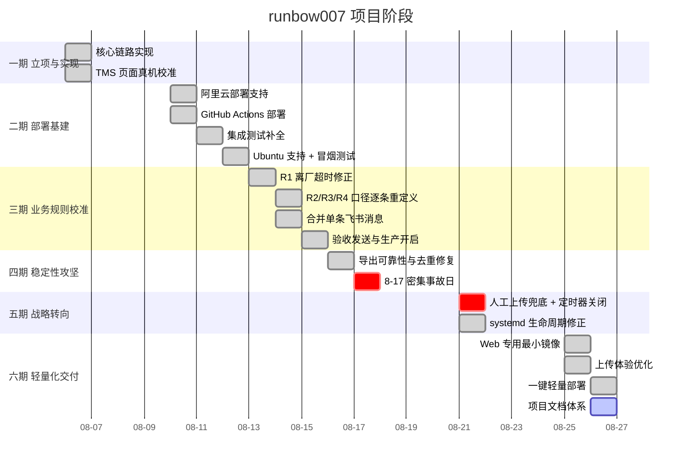

# runbow007 订单提醒工具 — 过程文档（关键节点 / 决策 / 沟通留痕）

| 项目 | 内容 |
| --- | --- |
| 文档版本 | v1.0 |
| 记录周期 | 2026-08-06 ～ 2026-08-26（21 天） |
| 编制日期 | 2026-08-26 |
| 用途 | 核心群留痕、项目复盘、交接材料 |
| 证据来源 | Git 提交历史与提交说明、代码注释中记录的实测数据、生产运行日志、GitHub PR 记录 |

> 本文档中的每一条事故、每一个数字（38 条、4750 条、12644 条、27.3 GB、70 分钟等）都来自当时的实测记录，均可在对应的 Git 提交说明或代码注释中查证。这是本项目刻意维持的做法：**阈值和防护措施如果没有出处，下一个人只能靠猜**。

---

## 1. 项目概览

| 项目 | 内容 |
| --- | --- |
| 项目名称 | runbow007 李宁 TMS 订单提醒工具（轻量版 runbow007-lite） |
| 仓库 | `haoxumgg/runbow007-lite` |
| 起止 | 2026-08-06 ～ 2026-08-26 |
| 交付形态 | 单机 Docker 部署，人工上传网页 + 飞书群推送 |
| 代码规模 | 约 3949 行 Python，149 个测试用例，75% 覆盖率门槛 |
| 提交数 | 62 次提交，涵盖 36 个 PR（原仓库 #1–#36）+ 轻量版 2 个 PR |
| 生产状态 | 已上线运行 |

### 1.1 阶段划分



---

## 2. 关键节点

### 节点 1 — 项目立项与核心实现（2026-08-06）

| 项目 | 内容 |
| --- | --- |
| 提交 | `7184d0e` 初始化 → `4cb7629` 核心实现 → `e59406f` 补齐模块 → `de7698f` TMS 真机校准 |
| PR | #1 `agent/initial-implementation` |

**交付**：
- 完整的处理链路：Excel 解析 → R1–R4 规则 → SQLite 去重 → 飞书推送
- 模块划分定型：`config` / `models` / `excel` / `rules` / `database` / `notifier` / `credentials` / `pipeline` / `downloader` / `cli`
- Playwright 驱动的 TMS 自动登录与下载

**当日就做的一件重要的事**：`de7698f` 用真实 TMS 账号跑通了完整下载流程，把所有 CSS 选择器按真实页面校准。**没有停留在"理论上能跑"。**

**留痕**：架构在第一天定型后，21 天内没有发生过重构。后续所有改动都是在这个骨架上加防护、修口径。这说明第一天的模块边界划对了。

---

### 节点 2 — 部署基建（2026-08-10 ～ 08-12）

| 日期 | 提交 | 内容 |
| --- | --- | --- |
| 08-10 | `b5b1848` (PR #2) | 阿里云 Alibaba Cloud Linux 部署支持 |
| 08-10 | `975bef9` (PR #3) | GitHub Actions 服务器部署 |
| 08-11 | `8bd88c6` (PR #4) | 补全上生产前的集成测试覆盖 |
| 08-12 | `f0a8ebc` (PR #5) | Docker 自举安装 |
| 08-12 | `db502dc` (PR #6) | Ubuntu 服务器支持 |
| 08-12 | `4224e17` (PR #7) | 加固 TMS 导出确认 |
| 08-12 | `2dbea40` (PR #8) | 有界的飞书冒烟测试 + TMS 导航加固 |
| 08-12 | `633e191` (PR #9) | 部署 SSH 保活 + TMS 进度日志 |
| 08-12 | `8c58a49` (PR #10) | 大导出放宽到十分钟 |
| 08-12 | `42a6562` (PR #11) | 慢导出跨重试复用 |

**决策留痕 — 为什么先补集成测试再上生产（`8bd88c6`，08-11）**

在部署脚本已经能用、Actions 已经能跑之后，**没有直接上生产**，而是先花一整天补集成测试。理由：这个系统会**自动往运营群发消息**，一旦发错，影响的是所有人的信任，而不只是一个报错日志。

这个决定在后面被反复验证是对的 —— 08-14 到 08-17 大量的规则口径修正和稳定性修复，全部靠测试用例守住了回归。

**决策留痕 — 冒烟测试必须"有界"（`2dbea40`，08-12）**

飞书冒烟测试引入了 `--max-send-orders`，**只允许 1–5 个唯一订单**。理由：验收要真发消息才有意义，但真发消息就有刷屏和误导运营的风险。硬编码 1–5 的上限，让"验收"这个动作物理上不可能变成事故。

同期还加了 `--force-send`，并在代码和文档里明确写着：**不要在常规生产处理里使用**。

**08-12 单日 7 个 PR 的含义**：这一天全部在打磨部署链路和 TMS 交互稳定性。`download_timeout` 从默认放宽到十分钟、慢导出跨重试复用 —— 说明当天已经明确感知到"TMS 导出慢且不稳"，但还在试图靠加超时和重试解决。**这个判断在 5 天后被推翻**（见节点 5）。

---

### 节点 3 — 业务规则逐条校准（2026-08-13 ～ 08-15）

这是与业务方沟通最密集的阶段。**四条规则里有三条在这几天被重新定义。**

| 日期 | 提交 | 规则变更 |
| --- | --- | --- |
| 08-13 | `f284757` (PR #12) | R1 离厂超时判定修正 + TMS 导出确认修正 |
| 08-14 | `53fc0bc` (PR #16) | **R2 改为从"实际到达"推导**，而非原先的口径 |
| 08-14 | `30da0d4` (PR #17) | **R3 细化为"到达与签收时间一致"的两个场景** |
| 08-14 | `819113a` (PR #18) | **R4 延迟原因提醒口径细化** |
| 08-14 | `dba6f96` (PR #15) | 支持按规则做飞书验收发送 |
| 08-14 | `21f75da` (PR #19) | **R1–R4 合并为一条飞书消息** |
| 08-15 | `1d45bcf` (PR #23) | 提醒可靠性与部署告警修复 |
| 08-15 | `620dd88` (PR #24) | **生产发送正式开启** |
| 08-15 | `ae4bc90` (PR #25) | 验收场景支持发送空汇总 |

**沟通记录 — 规则口径三次澄清**

| 规则 | 原始理解 | 澄清后的口径 | 澄清方式 |
| --- | --- | --- | --- |
| R2 | 按预计到达/其他字段判断 | **实际到达日期 = 今天 且 状态仍在途** | 业务方指出应以"实际到达"为准 |
| R3 | 单一的合同状态异常 | **必须以"实际到达时间 = 签收时间"为共同前提**，再分「客户未电子签」和「运营未操作签收」两个场景，责任方不同 | 业务方区分了两类责任 |
| R4 | 延迟提醒 | **只提醒"标了延迟但没填原因"的**，不提醒所有延迟单 | 业务方明确关注点是归因缺失 |

**留痕价值**：R3 拆成两个场景是这次沟通中最有价值的产出。两个场景的责任方完全不同（客户 vs 运营），如果合并成一条提醒，群里没人知道该谁动手。这个信息只能从业务方获得，代码里推不出来。

**决策留痕 — 四条规则合并为一条消息（`21f75da`，08-14）**

原设计是每条规则发一条飞书消息。改为合并，理由：**四条消息在群里就是刷屏，运营会开始屏蔽这个机器人**。一个没人看的提醒工具等于零价值。

合并后保留了一个关键细节：即使某条规则本轮无命中，也会在消息里显示「无符合条件订单」。这让群里能确认"这一轮确实检查过了这条规则"，而不是怀疑工具漏跑。

**决策留痕 — 验收要能发空汇总（`db4fa68`，08-15）**

看起来矛盾（生产不发空消息，验收却要能发空消息）。理由：验收时需要确认"消息通道是通的、格式是对的"，如果恰好没有命中就发不出消息，验收无法进行。所以 `--force-send` 允许发空汇总，而正常路径严格不发。

**里程碑 — 08-15 生产发送开启（`5397103`，PR #24）**

从 08-06 立项到 08-15 开启生产发送，用了 **9 天**。中间经历了完整的部署验证和三轮业务规则澄清。

---

### 节点 4 — 稳定性攻坚（2026-08-16 ～ 08-17）

生产运行 1 天后就暴露了系统性问题。这两天是整个项目技术含量最高的部分。

#### 4.1 从日志出发的系统性修复（08-16，`1f3a250` PR #26）

**问题发现方式**：复盘 8 月 16 日全天日志，发现 **20 次成功轮次中有 3 个整点完全没有产出**，失败全部落在 TMS 业务高峰，且**都卡在"点击导出"这一步**。

**根因（一条极隐蔽的库行为）**：

> Playwright 会**忽略** `Locator.is_visible(timeout=...)` 参数，退回页面默认的 45 秒。

后果是 `_visible_locator_or_button` / `_confirm_export` / `_click_visible_text` 等处设置的 30 秒、15 秒轮询**全部形同虚设** —— 单次探测就把 deadline 撑爆，抛出裸 TimeoutError。

**一次修复的 8 个问题**：

| # | 问题 | 修复 |
| --- | --- | --- |
| 1 | `is_visible(timeout=)` 被忽略 | 统一改走 `_visible_now()`，用 `wait_for` 做有界探测 |
| 2 | `_dom_click` 重复 `wait_for(visible)` | 去掉。调用方已确认可见性；Element UI 工具栏反复重渲染时这次重复等待会报 "resolved to visible" 却仍然超时（21:10 那轮的直接死因） |
| 3 | 一轮可能跑满一小时吃掉下一个整点 | 新增 50 分钟单轮重试预算，下载中心等待按剩余预算收缩 |
| 4 | `download_timeout_seconds` 过长 | 1200 → 600（实测 4672 单导出仅需 2–3 分钟） |
| 5 | 订单数自然漂移导致整轮失败 | 下载中心任务与 Excel 行数改为容差匹配（`tms.total_tolerance`） |
| 6 | 下载中心时间窗锚点错误 | 锚定到**点击导出的时刻**，而非整轮开始时刻 |
| 7 | systemd 超时过长 | `TimeoutStartSec` 75min → 55min，卡死的一轮在下个整点前收掉 |
| 8 | **文件锁跳过完全不可见** | 退出码 3 被 `SuccessExitStatus` 当成成功，监控上看不出整点被吃掉 → **必须记 ERROR 日志** |

同时修复了两个业务侧问题：
- `reopen_grace_hours` 静默期：命中集合每小时抖动时不再清空 `last_sent_at` 绕过每日重复提醒的限制；
- 每轮记录各规则前置条件计数：R1/R4 恒为 0 时能判断是数据本身没命中，还是取数口径把这些单子过滤掉了。

**方法论留痕**：**从日志出发，不从猜测出发。** 这次修复的每一条都对应日志里的一个具体现象和时间点。

#### 4.2 08-17 密集事故日

**一天之内 6 个 PR（#28～#33），全部是生产事故驱动。**

```mermaid
timeline
    title 2026-08-17 事故时间线
    17:33 : 视图继承事故 : TMS 视图被切到 38 条筛选 : 自动化继承后导出 38 条而非 4750 条 : 所有校验通过 : 真的发出 3 条错误提醒
    17:59-18:08 : 静默空转 : 下载中心匹配到成功任务却找不到下载链接 : 静默 continue 9 分钟 : 日志里完全无痕
    18:12 : 反向事故 : 继承到 12644 行的视图 : 单向闸门放行 : 照常算规则照常发飞书
    18:23 : 表格不出数 : 全新浏览器登录仅 6 秒 : 等表格出数据 192 秒仍无数据
    19:05 : 诊断代码挂死 : _capture_failure 截图超时后调 page.content() : 该 API 不接受 timeout : 挂死 70 分钟直到 CI 超时
    当晚 : 服务器失联 : 卡死的 Chromium 吃光 2GiB 内存 : sshd fork 不出子进程 : 阿里云命令助手也失联 : 只能控制台强制重启
```

##### 事故 A — 视图继承导致的错误提醒（17:33，最严重）

**事实经过**：人工在浏览器里把 TMS 视图切到一个只有 38 条的筛选条件。自动化用同一个账号登录后**原样继承**，导出了 38 条而不是 4750 条。

**根因**：TMS 的视图状态**按账号共享且粘性** —— 默认视图就是"上一次操作的视图"。

**致命之处（这是本项目最重要的一条教训）**：

> **所有校验都通过了。** 页面总数 38、Excel 行数 38，两者完全一致。条数容差和 UI 比对查不出任何异常。

于是照常算规则、照常发飞书：**R1 凭空冒出 36 个候选，R3 从 274 掉到 0，真的发出了 3 条基于残缺数据的提醒**。

**修复（`cfc9de0` PR #33）**：新增 `_guard_row_count` —— 与历史成功运行的行数比对。三个设计细节：

| 细节 | 内容 | 理由 |
| --- | --- | --- |
| 位置 | 放在 `upsert_orders` **之前** | 坏数据一行都不进库 |
| 基线 | 最近 5 次成功运行的**中位数** | 单次异常不能污染基线（见事故 C） |
| 兜底 | 行数 < 100 时跳过 | 小数据量下比例判断纯属噪声 |

报错信息里写清了怎么恢复，以及"月初数据重置会触发、可临时调低比例"。**报错信息本身就是运维文档。**

##### 事故 B — 静默空转 9 分钟（17:59～18:08）

下载中心匹配到 `success=True` 的任务，却找不到下载链接，代码是**静默 `continue`**。结果一直空转到 18:08 超时，**日志里完全无痕**。

**修复（`1a18c92` PR #34）**：加一条 warning 日志。

**教训**：任何 `continue` / `pass` / 空 `except` 都是一个潜在的黑洞。

##### 事故 C — 反向事故：视图变大（18:12）

继承到一个 **12644 行**的视图（正常 4750）。当时的闸门是**单向的**（只挡"太小"），直接放行，照常算规则、照常发飞书。

**修复（`1a18c92`）**：闸门改为双向，新增 `rules.max_row_ratio` 默认 1.5。

**同时暴露的连锁风险**：如果基线取"最近一次成功运行"，那次 12644 一旦通过就会成为基线，**下一轮正常的 4750 反而会被判成异常**。所以基线改成最近 5 次的中位数。

**留痕价值**：这是"修一个 bug 引入另一个 bug"的典型。防护措施本身也需要被审视其失效模式。

##### 事故 D — 持久化 profile 是流沙（当天多轮）

**观察到的现象**：凌晨 01–07 点七轮全部成功，白天一半在挂。

**根因推断**：差别在于**白天有人在动这个 TMS 账号**。持久化 profile 会把上一轮的标签页和 DOM 状态带到下一轮；TMS 是标签页式 SPA、视图状态还按账号共享，于是每轮启动时"DOM 里有几个标签页、停在哪个视图、哪些元素可见"完全不确定 —— **所有选择器都在这片流沙上撞运气**。

**修复（`1a18c92`）**：每轮全新浏览器 + 重新登录。保留 `tms.persistent_profile: true` 可退回旧行为（例如频繁登录触发 TMS 风控时）。

##### 事故 E — 诊断代码挂死 70 分钟（19:05，最讽刺）

**堵掉这一轮的，是前一天为了排查问题新加的失败诊断代码本身。**

经过：18:23 那次演练，全新浏览器登录只用了 6 秒（说明这条路是通的），但"等待订单表格出数据" 192 秒仍然没数据。随后 `_capture_failure` 先截图（15 秒超时正常抛出），接着去取页面 HTML —— 而 `page.content()` **不接受 timeout 参数**，页面卡死时无限期挂着，一挂 **70 分钟**，直到 GitHub 的 75 分钟工作流超时才被杀。

**修复（`7e08b24` PR #35）** 两处：

1. `_capture_failure` 改成**截图成功才取 HTML**。截图失败就说明浏览器已经不响应，这时候调 `page.content()` 必然挂死；
2. 新增 **SIGALRM 看门狗**，给单次尝试一个硬上限（`tms.attempt_timeout_seconds`，默认 900 秒）。

**为什么必须用信号**：现有的三层超时**全是"建议性"的**。

| 层 | 依赖什么才能触发 | 浏览器卡死时 |
| --- | --- | --- |
| Playwright `timeout` | 驱动进程回消息 | 失效 |
| 循环 `deadline` | 当前调用能返回 | 失效 |
| 50 分钟单轮预算 | 只在两次尝试之间检查 | 失效 |
| **SIGALRM** | **内核投递，不依赖任何用户态状态** | **有效** |

**已知限制**：Windows 没有 SIGALRM，CI 在该平台退化为无保护。生产是 Linux，不受影响。

**留痕（本项目最值得记住的一句）**：

> **诊断代码绝不能比它要诊断的问题更严重。**

##### 事故 F — 服务器被打死（当晚）

服务器只有 2 GiB 内存，compose 里**没有任何限制**。一个卡死的 headless Chromium（当时正在渲染继承来的 12644 行错误视图）把内存吃干净：

- sshd fork 不出子进程 → SSH 报 `Connection timed out during banner exchange`
- 阿里云命令助手也执行不了
- **最后只能从控制台强制重启**

**修复（`44a260c` PR #36）**：`mem_limit: 1200m` + `mem_swappiness: 0`。加上限之后，**撑爆的是容器而不是整台机器**，至少还能 SSH 进去看日志。

**当时的优先级判断（原文记录）**：

> "今晚暴露的问题排序里，'一次数据异常能把整台服务器打死'比数据错本身更严重。"

##### 附带事故 G — 磁盘被构建缓存吃掉（`4d63f68` PR #29）

buildx 的构建缓存**从不自动回收**。镜像本身约 1.9 GB，但每次构建都会把 Playwright 的 chromium（184 MB）、headless shell（115 MB）、ffmpeg 和 apt 依赖再塞一份进缓存。

**实测**：**51 条缓存记录占了 27.3 GB**，39 GB 的盘用到 80%，照那个速度几天就会写满。

**修复**：每次部署后 `docker builder prune --keep-storage 5GB`，保留热缓存供下次复用；命令在新版 Docker 中改名，逐个降级尝试；**清理失败绝不能让整个部署挂掉**，最后兜 `|| true`。

#### 4.3 08-17 复盘总结

| 事故 | 类别 | 修复 | 沉淀的原则 |
| --- | --- | --- | --- |
| A 视图继承 | 数据正确性 | 行数闸门（写库前） | 校验一致不等于数据正确 |
| B 静默空转 | 可观测性 | 补 warning 日志 | 静默的 continue 是黑洞 |
| C 反向越界 | 防护完备性 | 双向闸门 + 中位数基线 | 防护措施本身也会失效 |
| D 流沙状态 | 环境确定性 | 每轮全新浏览器 | 不确定的起点无法自动化 |
| E 诊断挂死 | 工具反噬 | 有界诊断 + SIGALRM | 诊断代码不能比问题更严重 |
| F 服务器被打死 | 爆炸半径 | 容器内存上限 | 局部故障不能变成全局故障 |
| G 磁盘写满 | 资源治理 | 构建缓存回收 | 不自动回收的东西一定会涨满 |

**共同点**：**7 个事故里有 5 个的表现是"看起来一切正常"** —— 校验通过、日志无痕、systemctl 显示正常、容器 Up。这类"沉默的失效"是这个项目学到的最贵的一课。

---

### 节点 5 — 战略转向：人工上传兜底（2026-08-21）

**这是整个项目最重要的一次方向调整。**

#### 5.1 决策背景

从 08-12 到 08-17，投入了**大量精力**试图让 TMS 自动下载稳定：加超时、加重试、加退避、加预算、加看门狗、换浏览器策略、改选择器定位方式。

**结论**：`李宁 TMS 的自动导出经常取不到数据，自动下载不能再是唯一入口。`

**这是一个承认失败的决定，也是一个正确的决定。** 问题的根因在 TMS 侧（后台导出任务本身不稳定、视图状态按账号共享），不在自动化代码里。继续加防护只是让失败方式变得更复杂，不会让成功率变高。

#### 5.2 决策内容（`50a0a92`）

| 决策 | 内容 |
| --- | --- |
| 新增人工上传网页 | 只依赖标准库的 WSGI 应用（`runbow007 web`） |
| **复用完全相同的链路** | 走 `Pipeline.process_file` —— 定时任务用的同一套表头校验、行数闸门、R1–R4 规则、去重和飞书发送 |
| 定时器默认关闭 | 部署脚本**主动 `disable`**，不是"不启用" |
| 开关移交人工 | `scripts/timers-alinux3.sh on\|off\|status` |
| 冒烟测试默认关闭 | Actions 的 `run_smoke_test` 也改为默认 `false` |

**"主动 disable 而不是不启用"的理由（原文记录）**：

> "只是'不启用'不够：上一次部署开着的定时器会原样留下来。TMS 导出经常取不到数据，默认必须是关的。"

**"部署不该被一次取不到数的 TMS 演练拖垮"** —— 这是把 `run_smoke_test` 默认关掉的理由。

#### 5.3 技术决策留痕

**为什么不用 Web 框架**

> "刻意不引入 Web 框架：服务器只有 2 GiB 内存，且这个页面每天只会被用几次。"

补充理由：Python 3.13 移除了 `cgi` 模块，`email` 库解析 multipart 需要先重组整个 MIME 消息 —— 与其引入依赖，不如自己切 60 行。

代价是路由、CSRF、会话、限速全部自己实现，靠 20 个测试用例守住（`tests/test_web.py`）。

**为什么 Web 进程不持有文件锁**

> "上传页面自己在每次上传时抢锁，常驻进程不能一直占着它。"

否则 Web 一启动就把定时任务永久饿死。

**两侧锁超时不同是刻意的**：

| 侧 | 超时 | 理由 |
| --- | --- | --- |
| CLI / 定时任务 | 1 秒 | 整点任务重叠说明上一轮超时了，跳过本轮比排队更合理 |
| 网页上传 | 3 秒 | 给人一个明确的即时反馈，而不是转圈 |

**安全设计**：会话 Cookie `HttpOnly` + `SameSite=Strict`、表单 CSRF 令牌、连续登录失败临时拒绝、口令支持 PBKDF2 哈希或环境变量注入。

#### 5.4 同日事故 — systemd 沉默的失效（`f80a3d1`）

**事实经过（08-21 部署日志）**：

- `docker compose ps` 显示 **Up**，端口也绑上了；
- **同一份日志里** `systemctl status` 是 `Active: inactive (dead)`。

**根因**：部署脚本是 `systemctl enable` 之后**直接调** `web-alinux3.sh start`。容器确实起来了，但 unit 从来没被启动过，只是被 enable 了。

**后果**：`systemctl stop runbow007-web.service` 会**静默地什么都不做**，容器照样在跑。运维想停服务时看不出任何异常。

**原文评价**：

> **"这种沉默的失效比直接报错难查得多。"**

**修复**：改成 `systemctl restart`。unit 没起来时等同于启动，已经起来时先跑 `ExecStop` 再重新拉起，顺带保证重新部署时容器一定换成新构建的镜像。

---

### 节点 6 — 轻量化交付（2026-08-25 ～ 08-26）

| 日期 | 提交 | 内容 |
| --- | --- | --- |
| 08-25 | `8d08764` | 优化上传提醒 + 发送本轮全部命中 |
| 08-25 | `195ef44` (PR #1) | Web 专用最小 Docker 镜像 |
| 08-26 | `1c66cbf` (PR #2) | 一键轻量部署 |

#### 6.1 决策 — 网页上传不做历史去重（`8d08764`）

**这是一个反直觉但正确的产品决策。**

自动任务去重是必须的（每小时跑一次，不去重就是刷屏）。但**人工上传是有意识的动作**：操作人刚从 TMS 下载文件、登录、勾选规则、点确认 —— 如果这时候因为"昨天已经提醒过"而只推 2 条，**人会怀疑工具坏了**。

人工触发的语义就是"我要看到这一轮的完整结果"。

**保留的边界**：即使全量推送，**没有任何命中时仍然不发空消息**，避免群里出现"本次无异常"的噪声。

#### 6.2 决策 — Web 专用最小镜像（`195ef44` PR #1）

既然主流程已经是人工上传，常驻的 Web 服务**根本不需要 Playwright 和 Chromium**。

| 镜像 | 构成 | 大小量级 |
| --- | --- | --- |
| `runbow007:local` | `pip install ".[automation]"` + `playwright install --with-deps chromium` | ~1.9 GB |
| `runbow007-lite-web:latest` | `pip install .` | ~200 MB |

**连带设计**：`credentials.py` 对 `keyring` 的导入做了 try/except 降级 —— Web 镜像没有 keyring，密钥全部走环境变量。

**收益**：内存上限从 1200 MB 降到 600 MB，构建时间和磁盘占用都下降一个量级。仅部署 Web 时，服务器规格要求从 2 GiB / 40 GB 降到 1 GiB / 10 GB。

#### 6.3 决策 — 一键部署脚本（`1c66cbf` PR #2）

`scripts/rebuild-web-alinux3.sh` 把首次安装和版本升级统一成**同一条命令**：

```bash
cd /opt/runbow007 && sudo ./scripts/rebuild-web-alinux3.sh
```

**幂等设计**：反复执行结果一致，不破坏已有数据。

**脚本内置的保护（每一条都对应一类可能的运维事故）**：

| 保护 | 防止的事故 |
| --- | --- |
| 校验端口范围 1024–65535 | 误配到特权端口或非法值 |
| 首次创建模板后主动退出 | 用错误的空配置启动服务 |
| 校验五个必填密钥非空（支持带引号的值） | 密钥缺失导致运行时才失败 |
| **先构建再替换容器** | 构建失败时提前中断当前服务 |
| 容器内二次校验，**只输出缺失字段名** | 密钥值泄露到日志 |
| 拒绝符号链接和项目目录外的运行目录 | 误改宿主机其他路径的权限 |
| **同名容器不属于本项目则拒绝部署** | 误删其他业务的容器 |
| 30 秒健康检查轮询失败则输出日志 | "部署成功"但服务实际没起来 |

**网络说明**：该服务器的 Docker bridge DNS 不可用，所以构建和运行时均复用宿主机网络（`network: host` / `network_mode: host`）。这是环境约束，不是设计偏好。

---

## 3. 决策清单汇总

| # | 决策 | 日期 | 驱动因素 | 状态 |
| --- | --- | --- | --- | --- |
| D-01 | 不使用 Web 框架，直接写 WSGI | 08-21 | 2 GiB 内存约束 + 低频使用 | 生效 |
| D-02 | SQLite 而非独立数据库 | 08-06 | 数据量小 + 内存约束 | 生效 |
| D-03 | 文件锁串行化而非任务队列 | 08-06 | 唯一正确性要求是"不并发写/发" | 生效 |
| D-04 | 数据合理性闸门放在写库之前 | 08-17 | 视图继承事故（38 条） | 生效 |
| D-05 | 网页上传全量推送不去重 | 08-25 | 人工触发的语义是"看完整结果" | 生效 |
| D-06 | 每轮全新浏览器 | 08-17 | 持久化 profile 是流沙 | 生效 |
| D-07 | SIGALRM 看门狗 | 08-17 | 诊断代码挂死 70 分钟 | 生效 |
| D-08 | 容器内存上限 | 08-17 | Chromium 打死整台服务器 | 生效 |
| D-09 | Web 专用最小镜像 | 08-25 | 主流程转为人工上传 | 生效 |
| D-10 | buildx 缓存主动回收 | 08-17 | 51 条缓存占 27.3 GB | 生效 |
| D-11 | 定时任务默认关闭且主动 disable | 08-21 | TMS 导出不稳定 | 生效 |
| D-12 | systemd 用 restart 而非 enable + 直接调脚本 | 08-21 | 沉默的失效 | 生效 |
| D-13 | `compare_digest` 前先编码 | 08-21 | 中文口令导致 500 | 生效 |
| D-14 | 口令支持 PBKDF2 哈希 | 08-21 | config.yaml 权限弱于 secrets.env | 生效 |
| D-15 | 飞书消息合并为单条 | 08-14 | 防刷屏，防被屏蔽 | 生效 |
| D-16 | 验收发送硬限制 1–5 单 | 08-12 | 验收不能变成事故 | 生效 |
| D-17 | 上生产前先补集成测试 | 08-11 | 会自动发群消息，错了影响信任 | 生效 |

---

## 4. 沟通与协作记录

### 4.1 与业务方

| 时间 | 议题 | 结论 | 落地 |
| --- | --- | --- | --- |
| 08-06 前 | 四类异常场景定义 | R1–R4 初版口径 | `4cb7629` |
| 08-13 | R1 离厂超时判定 | 修正判定逻辑 | PR #12 |
| 08-14 | R2 判定依据 | **改为从"实际到达"推导** | PR #16 |
| 08-14 | R3 场景细分 | **拆为「客户未电子签」和「运营未操作签收」，责任方不同** | PR #17 |
| 08-14 | R4 关注点 | **只提醒"标了延迟但没填原因"** | PR #18 |
| 08-14 | 消息形式 | **合并为一条，防刷屏** | PR #19 |
| 08-15 | 验收方式 | 按规则、按订单数限量真实发送 | PR #15、#24 |
| 08-15 | 生产开启 | **正式开启真实发送** | PR #24 |
| 08-21 | 自动下载不可靠 | **改为人工上传主流程** | `50a0a92` |
| 08-25 | 人工上传去重语义 | **人工上传每次全量推送** | `8d08764` |

### 4.2 与运维

| 时间 | 议题 | 结论 |
| --- | --- | --- |
| 08-10 | 服务器与部署方式 | 阿里云 ECS + Docker Compose + systemd，路径固定 `/opt/runbow007` |
| 08-12 | 操作系统兼容 | 同时支持 Alibaba Cloud Linux 3 和 Ubuntu 24.04 |
| 08-12 | 部署触发方式 | GitHub Actions **仅手动触发**，push 不自动部署 |
| 08-17 | 服务器被打死 | 加容器内存上限；确认服务器规格为 2 GiB |
| 08-17 | 磁盘占用 | 每次部署回收 buildx 缓存，保留 5 GB 热缓存 |
| 08-21 | 服务生命周期 | 统一由 systemd 管理，禁止绕过 unit 直接调脚本 |
| 08-26 | 网络限制 | 该服务器 Docker bridge DNS 不可用，轻量部署使用 host 网络 |
| 全程 | 访问控制 | 上传页无 HTTPS，**安全组必须限制到具体办公出口 IP** |

### 4.3 安全相关约定

| 约定 | 落地位置 |
| --- | --- |
| 密码和 App Secret 不进仓库、YAML、日志、示例文件 | `.gitignore`、`.dockerignore`、`config.example.yaml` 只放账号不放密码 |
| Linux 用 `0600` 的 `/etc/runbow007/secrets.env` | `deploy/secrets.env.example` |
| Windows 用系统凭据管理器 | `credentials.py` |
| GitHub Actions 用 Repository secrets | `.github/workflows/deploy.yml` |
| 部署后必清理临时凭据 | `if: always()` 步骤 |
| 上传页无 HTTPS 时必须限制来源 IP | README + 部署手册反复强调 |
| 默认口令 `admin123456` 仅供首次登录 | 启动时输出警告日志 |

---

## 5. 质量保障留痕

### 5.1 CI 门禁（全程生效）

| 项目 | 配置 |
| --- | --- |
| 触发 | 每次 `push` 和 `pull_request` |
| 平台 | `ubuntu-latest` + `windows-latest` **双平台** |
| Python | 3.12 |
| 静态检查 | `ruff check .`（规则集 `E,F,I,UP,B`，行宽 100） |
| 测试 | `pytest`，**149 个用例** |
| 覆盖率 | **强制 ≥ 75%**（`--cov-fail-under=75`） |

**为什么要跑 Windows**：本地开发在 Windows，生产在 Linux。文件锁、路径、SIGALRM 在两个平台行为不同 —— `4909c3a`（08-17）就是专门修"让看门狗测试在 Windows 上保持绿色"的。

### 5.2 测试用例分布

| 测试文件 | 覆盖内容 |
| --- | --- |
| `test_config.py` | 配置加载、环境变量覆盖、参数范围校验 |
| `test_excel.py` | 双格式解析、表头别名、必填校验、唯一性、总条数容差 |
| `test_rules.py` | R1–R4 触发与不触发边界、在途状态别名、去重键 |
| `test_database.py` | 事件状态机、去重判断、静默期、历史行数 |
| `test_notifier.py` | 消息格式、@ 逻辑、合并消息、飞书重试与错误 |
| `test_pipeline_integration.py` | 端到端：归档、去重、全量发送、行数闸门、失败留痕 |
| `test_web.py` | 登录、限速、CSRF、会话、上传校验、锁冲突、安全头、multipart |
| `test_downloader.py` | 可见性探测、导出按钮选择、下载中心匹配、看门狗 |
| `test_cli_integration.py` | 子命令、退出码、演练模式 |
| `test_credentials.py` | 环境变量优先、keyring 降级 |
| `test_retention.py` | 过期清理、无效保留期 |
| `test_deployment_files.py` | systemd 单元、compose、脚本的一致性 |

**每个事故都留下了对应的测试用例**，例如：

| 用例 | 对应事故 |
| --- | --- |
| `test_pipeline_rejects_a_suspiciously_small_export` | 事故 A（38 条） |
| `test_pipeline_rejects_a_suspiciously_large_export` | 事故 C（12644 条） |
| `test_pipeline_row_guard_baseline_survives_one_bad_run` | 事故 C 的连锁风险（基线污染） |
| `test_login_accepts_a_non_ascii_password` | D-13（中文口令 500） |
| `test_upload_reports_a_busy_job_lock_instead_of_queueing` | D-03（锁冲突反馈） |
| `test_pipeline_send_all_current_does_not_send_an_empty_message` | D-05 的边界（不发空消息） |

### 5.3 代码注释规范

本项目刻意维持的做法：**所有非显而易见的设计决策在代码里写明"为什么"，并附上实测日期与数据。**

示例（`pipeline.py::_guard_row_count` 的 docstring）：

> TMS 的视图状态是账号级共享且粘性的——默认视图就是"上一次操作的视图"。
> 2026-08-17 17:33 实测：人工在浏览器里把视图切到一个只有 38 条的筛选，
> 自动化用同一个账号登录后原样继承，导出了 38 条而不是 4750 条。
> 致命之处在于当时所有校验都通过了……

**理由**：阈值、超时、闸门比例这些数字如果没有出处，下一个维护者只能靠猜。猜错的代价是重新经历一遍同样的事故。

---

## 6. 复盘与经验沉淀

### 6.1 做对了的

| 事项 | 说明 |
| --- | --- |
| **第一天就用真实 TMS 校准** | 架构 21 天没重构，模块边界从第一天就是对的 |
| **上生产前先补集成测试** | 后续大量规则口径修正全靠测试守住回归 |
| **每次事故都写清"为什么"** | 提交说明和代码注释里保留了完整的事实和数据 |
| **验收路径硬限制** | `--max-send-orders` 上限 1–5，物理上防止验收变事故 |
| **敢于承认自动化失败** | 08-21 转向人工上传，比继续加防护更正确 |
| **复用同一条链路** | 三个入口共用 `Pipeline.process_file`，不存在第二套实现 |
| **双平台 CI** | 及时发现了 SIGALRM 的平台差异 |

### 6.2 走过的弯路

| 弯路 | 代价 | 教训 |
| --- | --- | --- |
| 08-12～08-17 反复加超时/重试试图救活自动下载 | 5 天工作量 | 根因在外部系统时，加防护只会让失败方式更复杂 |
| 行数闸门最初设计成单向 | 12644 行的错误数据放行了一轮 | 防护措施本身也需要被审视其失效模式 |
| 失败诊断代码没有超时保护 | 挂死 70 分钟，占用一整个 CI 配额 | 诊断代码不能比它要诊断的问题更严重 |
| compose 一开始没有内存限制 | 整台服务器失联，只能强制重启 | 局部故障不能允许升级成全局故障 |
| 部署脚本绕过 systemd 直接调脚本 | 停服命令静默失效 | 用了进程管理器就必须完全交给它 |
| buildx 缓存没有回收策略 | 27.3 GB 磁盘，差点写满 | 任何不自动回收的东西一定会涨满 |

### 6.3 核心经验

**关于可靠性**

> 7 个事故里有 5 个的表现是"看起来一切正常"—— 校验通过、日志无痕、`systemctl` 显示正常、容器 Up。
> **沉默的失效比直接报错难查得多。**
> 系统必须主动质疑自己的输入（行数闸门）和自己的状态（健康检查、ERROR 日志）。

**关于外部依赖**

> TMS 没有 API、导出不稳、视图状态按账号共享且粘性。
> 面对这类不可控依赖，**正确的做法不是把自动化做得更复杂，而是设计一条不依赖它的兜底路径**。
> 人工上传页反而成了主流程。

**关于业务规则**

> 四条规则里有三条在开发过程中被重新定义。R3 拆成两个责任方不同的场景，这个信息只能从业务方获得。
> **不要在没有业务方逐条确认的情况下认为自己理解了规则。**

**关于资源约束**

> 2 GiB 内存这个约束塑造了整个技术选型：无 Web 框架、SQLite、文件锁而非队列、Web 专用最小镜像。
> **约束不是障碍，是设计的输入。**

---

## 7. 遗留事项

| # | 事项 | 影响 | 建议 |
| --- | --- | --- | --- |
| 1 | `downloads/` 清理只在 CLI 任务结束时执行 | 只跑 Web 时归档无限增长 | 加一条 cron（部署手册 7.5 已给方案） |
| 2 | 上传页无 HTTPS | 凭据明文传输 | 前置 HTTPS 反代 + `secure_cookie: true` |
| 3 | 单账号共享登录 | 操作无法追溯到人 | 需要审计时再引入多账号 |
| 4 | 自动下载定时任务默认关闭 | 依赖人工触发 | TMS 导出稳定后可重新评估 |
| 5 | 行数闸门月初可能误触发 | 需要人工临时调阈值 | 观察实际频率再决定是否优化 |
| 6 | 会话存在进程内存 | 重启后需重新登录 | 当前用量下可接受 |
| 7 | Windows 平台无 SIGALRM 保护 | CI 在该平台退化 | 生产是 Linux，不受影响 |
| 8 | 需求文档待业务方逐条签署 | 需求基线未正式固化 | 见文档 1 第 6 节确认表 |

---

## 8. 交付清单

### 8.1 文档

| 文档 | 路径 | 用途 |
| --- | --- | --- |
| 需求文档（确认版） | `docs/01-需求文档-确认版.md` | 业务背景、范围、非目标、规则、验收标准 |
| 技术说明书 | `docs/02-技术说明书.md` | 架构、模块、选型、数据流、接口、部署、性能、15 项关键技术决策 |
| 系统使用说明书 | `docs/03-系统使用说明书.md` | 功能清单、操作步骤、权限、FAQ、异常处理 |
| 生产部署手册 | `docs/04-生产部署手册.md` | 环境准备、部署、配置基线、验收、运维、备份、回滚 |
| 过程文档（本文） | `docs/05-过程文档-关键节点与决策留痕.md` | 关键节点、决策、沟通记录、复盘 |

### 8.2 代码与配置

| 类别 | 内容 |
| --- | --- |
| 应用代码 | `src/runbow007/` 12 个模块，约 3949 行 |
| 测试 | `tests/` 12 个文件，149 个用例 |
| 容器 | `Dockerfile`（完整）、`Dockerfile.web`（轻量） |
| 编排 | `compose.yaml`（完整）、`compose.web.yaml`（轻量） |
| systemd | `deploy/systemd/` 6 个 unit |
| 脚本 | `scripts/` 10 个部署与运维脚本 |
| CI/CD | `.github/workflows/ci.yml`、`deploy.yml` |
| 配置模板 | `config.example.yaml`、`deploy/*.env.example` |

### 8.3 生产环境

| 项目 | 状态 |
| --- | --- |
| 部署形态 | 形态 A（仅上传页，轻量镜像） |
| 服务 | `runbow007-web` 容器常驻，systemd 托管 |
| 自动下载定时器 | **disabled** |
| 生产发送 | 已开启（网页上传固定直接发送） |
| 数据留存 | SQLite + Excel 归档 + 日志，保留 30 天 |

---

## 附录：完整提交时间线

| 日期 | 提交 | PR | 内容 |
| --- | --- | --- | --- |
| 08-06 | `7184d0e` | — | 初始化仓库 |
| 08-06 | `4cb7629` | #1 | 实现轻量 TMS 提醒自动化 |
| 08-06 | `e59406f` | #1 | 补齐剩余应用模块 |
| 08-06 | `de7698f` | #1 | **真实 TMS 下载流程校准** |
| 08-10 | `b5b1848` | #2 | 阿里云 Linux 部署支持 |
| 08-10 | `975bef9` | #3 | GitHub Actions 服务器部署 |
| 08-11 | `8bd88c6` | #4 | **补全上生产前的集成测试** |
| 08-12 | `f0a8ebc` | #5 | Docker 自举安装 |
| 08-12 | `db502dc` | #6 | Ubuntu 服务器支持 |
| 08-12 | `4224e17` | #7 | 加固 TMS 导出确认 |
| 08-12 | `2dbea40` | #8 | **有界飞书冒烟测试** + TMS 导航加固 |
| 08-12 | `633e191` | #9 | 部署 SSH 保活 + TMS 进度日志 |
| 08-12 | `8c58a49` | #10 | 大导出放宽到十分钟 |
| 08-12 | `42a6562` | #11 | 慢导出跨重试复用 |
| 08-13 | `f284757` | #12 | **R1 离厂超时修正** + 导出确认修正 |
| 08-14 | `a73d51d` | #13 | 稳定完整的 TMS 导出下载 |
| 08-14 | `fbf6982` | #14 | 冒烟测试加载部署环境变量 |
| 08-14 | `dba6f96` | #15 | 支持按规则做飞书验收发送 |
| 08-14 | `53fc0bc` | #16 | **R2 改为从实际到达推导** |
| 08-14 | `30da0d4` | #17 | **R3 细化为两个场景** |
| 08-14 | `819113a` | #18 | **R4 口径细化** |
| 08-14 | `21f75da` | #19 | **R1–R4 合并为一条消息** |
| 08-14 | `e62d765` | #20 | 重试缺失的导出任务 |
| 08-14 | `47f42a6` | #21 | 选择可见的导出按钮 |
| 08-14 | `0f60462` | #22 | 刷新可见的下载中心工具栏 |
| 08-15 | `c7aa4d4` | #23 | 提醒可靠性与部署告警修复 |
| 08-15 | `5397103` | #24 | **生产发送正式开启** |
| 08-15 | `db4fa68` | #25 | 验收支持发送空汇总 |
| 08-16 | `1f3a250` | #26 | **从 8/16 日志出发的 8 项系统性修复** |
| 08-16 | `6af99ce` | #27 | 修正过紧的可见性探测与总数匹配回归 |
| 08-17 | `28e1459` | #28 | 两阶段元素查找 + 可配置导出任务窗口 |
| 08-17 | `4d63f68` | #29 | **回收 buildx 构建缓存（27.3 GB）** |
| 08-17 | `1f7b750` | #30 | 等表格报告行数后再点导出 |
| 08-17 | `81be138` | #31 | 按图标类名定位下载中心 |
| 08-17 | `353f44d` | #32 | 读取可见分页 + 等待加载遮罩 |
| 08-17 | `c49772b` | #32 | 停止重填日期并说明预设保留原因 |
| 08-17 | `cfc9de0` | #33 | **行数闸门：拦截可疑的小导出（38 条事故）** |
| 08-17 | `1a18c92` | #34 | **每轮全新浏览器 + 命名失败环节 + 双向闸门（12644 条事故）** |
| 08-17 | `7e08b24` | #35 | **SIGALRM 看门狗 + 诊断不再挂死（70 分钟事故）** |
| 08-17 | `4909c3a` | #35 | 让看门狗测试在 Windows 上保持绿色 |
| 08-17 | `44a260c` | #36 | **容器内存上限（服务器失联事故）** |
| 08-21 | `50a0a92` | — | **人工上传兜底 + 定时器默认关闭（战略转向）** |
| 08-21 | `f80a3d1` | — | **systemd 接管上传页生命周期（沉默失效）** |
| 08-25 | `8d08764` | — | **上传提醒优化 + 发送本轮全部命中** |
| 08-25 | `195ef44` | #1 | **Web 专用最小镜像** |
| 08-26 | `1c66cbf` | #2 | **一键轻量部署** |
| 08-26 | 本次 | — | 项目文档体系（5 份） |
